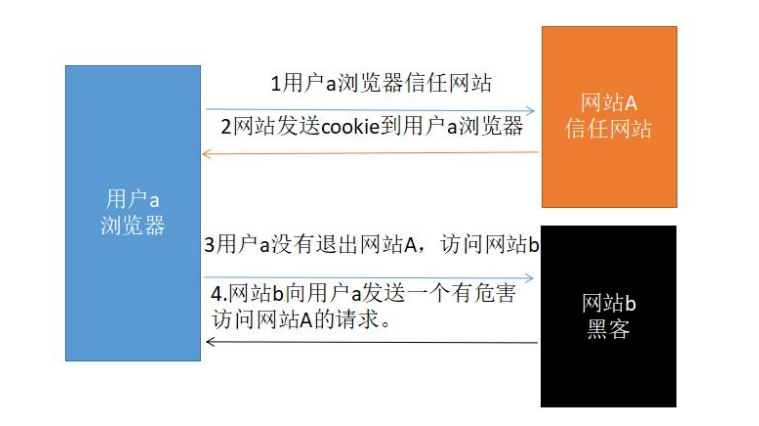

## 0x00 CSRF跨站请求伪造漏洞概述
CSRF，（Cross-site request forgery） 跨站请求伪造，挟持用户在当前已登录的 Web 站点上执行非本意操作的攻击方法。  
简单地说，是攻击者通过一些技术手段欺骗用户浏览器去访问一个自己曾经认证过的网站并执行一些操作（如发邮件，修改用户设置，甚至财产操作如转账和购买商品等）。
由于浏览器曾经认证过，所以被访问的网站会认为是真正的用户操作而去执行。这利用了 web 中用户身份验证的一个漏洞：简单的身份验证只能保证请求发自某个用户的浏览器，却不能保证请求本身是用户自愿发出的。

## 0x01 CSRF漏洞攻击原理
1. 用户打开浏览器，访问登陆受信任的 A 网站；
2. 在用户信息通过验证后，服务器会返回一个 cookie 给浏览器，用户登陆网站 A 成功；
3. 用户未退出网站 A，在同一浏览器中，打开一个危险网站 B；
4. 网站 B 收到用户请求后，返回包含恶意代码的页面，要求访问网站 A；
5. 浏览器收到恶意代码后，在用户不知情的情况下，利用cookie信息向网站 A 发出恶意请求，网站 A 会根据 cookie 信息以用户的权限去处理该请求，导致来自网站 B 的恶意代码被执行；  

攻击原理图：  

  

## 0x02 CSRF漏洞攻击
登录网站后，在个人信息修改页面，如果没有发现任何验证信息（即修改完用户信息直接进行提交），则可能存在CSRF漏洞。  
在burp中抓取数据包后，选择generate CSRF-POC 会生成一个html页面，只要诱骗用户点击这个网站中的链接或访问这个页面，就会触发 CSRF漏洞。  

受害者受到攻击的途径有：
1. 受害者登录网站后，没有退出的情况下，访问网站 b 触发；
2. 在存在 XSS 漏洞的网站，触发 xss 漏洞，自动调用这个 poc.html；

## 0x03 CSRF防御方案
1. 常用做法是增加token验证，对关键操作增加token，每次随机；
2. 安全会话管理：不在客户端保存敏感信息（如身份验证信息），关闭浏览器时会话过期，设置超时会话过期机制；
3. 访问控制安全管理：执行关键操作需要进行二次验证，通过Referer来限制原页面地址；
4. 增加验证码：一般用在登录接口防止暴力破解，也可以用在一些重要操作的表单中；