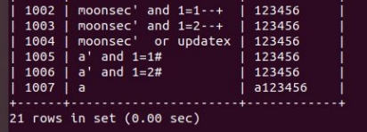
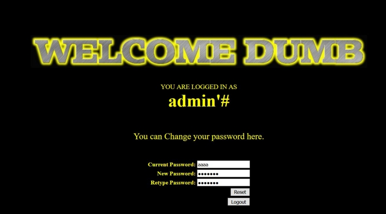
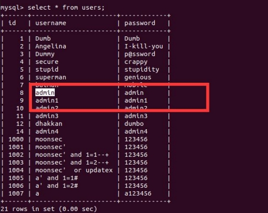
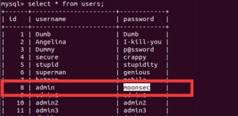

## 0x00 二次注入攻击原理
二次注入也是Web应用程序中广泛存在的漏洞形式，相比于一次注入更难被发现。  
其原理是：数据第一次被插入到数据中时，仅仅使用了addslashes函数或 get_magic_quotes_gpc方法对其中的特殊字符进行了转义，这个转义方式是存在缺陷的。  
其转义特点是：虽然参数在过滤后会添加 “\” 进行转义，但是“\”并不会插入到数据库中，在写入数据库的时候还是保留了原来的数据。  
在数据进入到数据库后，开发者就认为数据可信，在下一次查询读取数据时，如果没有检验和处理，直接取出脏数据，就会造成二次注入。

## 0x01 二次注入过程
二次注入主要分两步进行，首先是插入恶意数据到数据库库中，然后引用恶意数据。  
第一步，把数据插入数据库的时候，对其特殊字符进行转义，在写入数据库时还保留了原来的恶意数据。  
第二步引用恶意数据，已经存在数据库中的数据被认为是可信了，直接取出脏数据带入sql语句中，就会造成二次注入。

## 0x02 二次注入代码分析
以下为注册新用户的代码，首先接收用户名和密码，利用mysql_escape_string函数将特殊字符过滤。
```php
$username = mysql_escape_string($_POST['username']);
$pass = mysql_escape_string($_POST['password']);
$re_pass = mysql_escape_string($POST['re_password']);

$sql = "insert into users(username,password) values (\"$username\",\"$pass\")";
```
mysql_escape_string 函数会将特殊字符进行过滤 如' 经过转义就成了\' 然后用 insert into 存入在数据库中。  
该网页的登陆功能也是利用 mysql_real_escape_string 函数对输入的参数进行转义，转义之后在数据库中查找指定的账号和密码，再传入到 session 里。
login.php关键源码如下：
```php
$username = mysql_real_escape_string($_POST['login_user']);
$password = mysql_real_escape_string($_POST['login_password']);
$sql = "select * from users where username='$username' and password = 'password'";

$login = sqllogin();

$_SESSION["username"]= $login;
```

跟上面一样，在pass_change（修改密码）源代码中，直接在SEEEION中获取用户名，就会取出脏数据，使用脏数据用户名进行密码修改，如果这条脏数据会改变sql语句逻辑，就可能修改任意用户的密码。  
$_SESSION['username'] 复制给$username 无任何过滤再带入 UPDATE 语句中造成注入。整个流程就是先注册用户，用户名包含脏数据，更改密码时会触法注入。  

## 0x03 黑盒环境下的二次注入测试
首先需要确定测试的网站是否存在过滤，一般都会对输入参数进行过滤，然后寻找可能会带入恶意数据二次使用的地方。  
例如：注册用户+修改密码，邮箱注册+修改密码，文章添加+文章编辑等，找到一切存在数据二次使用的功能点。  
二次注入测试SQL注入多半是字符型注入，需要特殊注意闭合问题。  
现在注册用户 a’ ，再分别注册用户 a' and 1=1# 和a' and 1=2# ，然后再找到可能触发的地方。  
当修改 a' and 1=1# 这个用户的密码时，可以发现 用户a 的密码被修改了。
  
这种情况下就可以判断为存在二次注入，一般利用思路就是看能不能注册一个 admin' # 来修改管理员密码。在sqli-lab 24这里是可以的：


