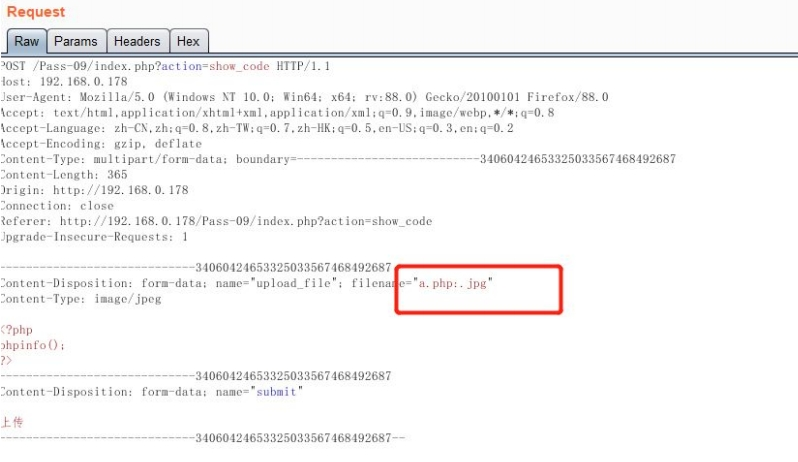
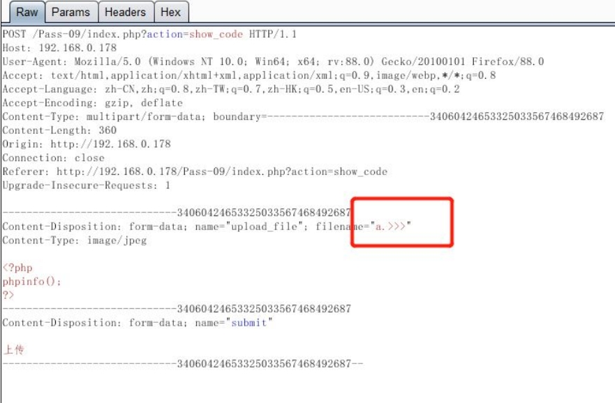

## 0x00 文件上传漏洞概述
文件上传漏洞是指，由于程序员没有对上传的文件做严格的验证和文件名过滤，导致用户可以越过其本身权限向服务器上传可执行的动态脚本文件。常见的包括图片上传和OA办公文件上传等，这些接口如果过滤不严格，攻击者上传可执行脚本文件到服务器中，就可以获取服务器权限，进一步危害服务器。

## 0x01 文件上传漏洞危害
攻击者可以通过上传恶意文件（webshell）控制整个网站，甚至是控制服务器。  
上传webshell后门，可以很方便的查看服务器信息，查看目录，执行系统命令等。

## 0x02 文件上传的原理
文件上传的过程：  
客户端：  
1. 选择要上传的文件；
2. 服务器接收；
3. 网站程序判断；
4. 临时文件；
5. 移动到指定路径下存储；
  
服务端需要有一个特定的程序来接收资源。  
```php
<?php
if ($_FILES["file"]["error"] > 0)
{
echo "Error: " . $_FILES["file"]["error"] . "<br />";
}
else
{
echo "Upload: " . $_FILES["file"]["name"] . "<br />";
echo "Type: " . $_FILES["file"]["type"] . "<br />";
echo "Size: " . ($_FILES["file"]["size"] / 1024) . " Kb<br />";
echo "Stored in: " . $_FILES["file"]["tmp_name"];
}
?>
```
给用户显示的前端代码。  
```html
<html></html>
<head></head>
<body>
<form action="upload.php" method="post" enctype="multipart/form-data">
<label for="file">Filename:</label>
<input type="file" name="file" id="file" />
<br />
<input type="submit" name="submit" value="Submit" />
</form>
</body>
</html>
```
文件上传时，会返回一些代码给客户端，根据返回值判断文件上传状态：
- 0 ：没有发生错误，文件上传成功；
- 1 ：上传的文件超过了 php.ini 中 upload_max_filesize 选项限制的值；
- 2 ：上传文件的大小超过了 HTML 表单中 MAX_FILE_SIZE 选项指定的值；
- 3 ：文件只有部分被上传，上传不完整；
- 4 ：没有文件被上传；  
  
## 0x03 文件上传大概分类
文件上传整体上可以分为直接文件上传和条件上传。直接文件上传没有任何限制，直接getshell。条件上传一般是对文件上传只做了简单的限制（文件验证 和 权限认证），可以绕过限制上传后门，从而导致网站被控制。

## 0x04 文件上传漏洞修复方案
1. 网站中若存在文件上传模块，要做好权限认证，不能让匿名用户访问；
2. 文件上传目录禁止脚本文件执行，这样即使上传了后门的动态脚本也不能解析；
3. 设置上传白名单，白名单只允许图片上传如，jpg png gif 其他文件均不允许上传；

## 0x05 文件上传漏洞攻击方法
寻找测试网站的文件上传模块，通过抓包上传恶意文件进行测试，上传后缀名为asp，php，aspx等的动态语言脚本，查看返回包信息，判断是否可以直接上传，如果不能直接上传，测试是否可以突破限制。  

## 0x06 常见网站的文件后缀名
可执行脚本的文件后缀名，可以被网站目录解析，以下是常见后缀名和对应站点。
```txt
asp - Active Server Pages (ASP) 语言，用于微软的 IIS (Internet Information Services) 中间件。
asa - ASP 的文件，通常用于存储全局会话、应用程序级事件和配置。
cdx - 一般指 Microsoft 的数据库索引文件，或者某些动态网页内容的缓存文件。
cer - 证书文件，通常用于 SSL/TLS 证书验证，不是动态脚本语言。
php - PHP 语言，通常运行在 Apache、Nginx 等 Web 服务器上。
aspx - ASP.NET 的扩展名，用于 Microsoft 的 IIS 服务器。
ashx - ASP.NET 的 HTTP 处理程序文件，处理 Web 请求。
jsp - Java Server Pages，用于运行在 Apache Tomcat 或其他支持 Java 的服务器中。
php3 - PHP 的旧版本扩展名（PHP 3.x 时代）。
php.a - 可能是特定 PHP 文件的自定义后缀，通常用于标识某些定制的 PHP 功能。
shtml - Server-Side Includes (SSI) 文件，可以在 Apache 或 IIS 中处理服务器端动态包含。
phtml - PHP 文件的一种扩展名，类似于 .php 文件。
```

## 0x07 任意文件上传漏洞
任意文件上传，直接文件上传，这种漏洞危害极大，如果攻击者能直接上传恶意脚本到网站存放的目录，并且这个目录可以解析动态脚本语言，那么攻击者就能直接获取网站管理权限，甚至提权控制服务器。  
任意文件上传漏洞代码分析：  
```php
<?php
if(isset($_POST['upload'])){
    $target_path="./uploads/";
    $target_path.=basename($_FILES['uploaded']['name']);

    if(!move_uploaded_file($_FILES['uploaded']['tmp_name'],$target_path)){
        echo '<pre>Your image was not uploaded!</pre>';
    }else{
        echo '<pre>{$target_path} was not uploaded!</pre>';
    }
}
?>
```
可以上传任意文件，如菜刀一句话木马等，即可获得webshell。

## 0x08 绕过前端JS检测进行文件上传
在文件上传时，有些网站会在前端对文件名进行验证，一般检测后缀名是否为上传的格式。如果文件格式不对，会弹出提示文字。  
此时数据包并没有被发送，只在客户端进行了JS校验，验证不通过便不会提交到服务器处理。  
绕过JS校验检测的方法：  
1. 抓包修改后缀名：把动态脚本的文件扩展名改成符合要求的，通过JS校验后再抓包把文件扩展名修改回来；
2. 修改前端代码：把JS校验逻辑删除即可，在上面例子中删除 return checkFile() ，或者修改checkFile()的代码逻辑，把动态脚本的后缀名添加到白名单中；  

代码分析：
```javascript
function checkFile(){
    var file = document.getElementsByName('upload_file')[0].value;
    if (file == null || file == ""){
        alert("请选择要上传的文件！")；
        return false;
    }
    var allow_ext = ".jpg|.png|.jpeg|.gif";
    var ext_name = file.substring(file.lastIndexOf("."));

    //判断文件类型是否允许上传
    if(allow_ext.indexOf(ext_name + "|")== -1){
        alert("errMsg 该文件类型不允许上传！");
        return false;
    }
}
```

## 0x09 绕过content-type检测进行文件上传
有些上传模块会对HTTP的类型头进行检测，只有检测为符合要求的文件格式才会允许上传到服务器。  
服务端一般是通过数据包中的 content-type 字段来判断文件类型，所谓Content-Type就是互联网媒体类型也就是MIME类型，这个在客户端是可以被修改的。  
代码分析：  
```php
$is_upload = false;
$msg = null;
if (isset($_POST['submit'])) {
    if (file_exists(UPLOAD_PATH)) {
        if (($_FILES['upload_file']['type'] == 'image/jpeg') || ($_FILES['upload_file']['type'] == 'image/png') || ($_FILES['upload_file']['type'] == 'image/gif')) {
            $temp_file = $_FILES['upload_file']['tmp_name'];
            $img_path = UPLOAD_PATH . '/' . $_FILES['upload_file']['name']            
            if (move_uploaded_file($temp_file, $img_path)) {
                $is_upload = true;
            } else {
                $msg = '上传出错！';
            }
        } else {
            $msg = '文件类型不正确，请重新上传！';
        }
    } else {
        $msg = UPLOAD_PATH.'文件夹不存在,请手工创建！';
    }
}
```
函数分析：  
$_FILES，FILES 是一个预定义的数组，用来获取通过 POST 方法上传文件的相关信息。如果为单个文件上传，那么 $_FILES 为二维数组；如果为多个文件上传，那么 $_FILES 为三维数组。  
```txt
$_FILES["file"]["name"] – 被上传文件的名称
$_FILES["file"]["type"] – 被上传文件的类型
$_FILES["file"]["size"] – 被上传文件的大小，以字节计
$_FILES["file"]["tmp_name"] – 存储在服务器的文件的临时副本的名称
$_FILES["file"]["error"] – 由文件上传导致的错误代码
```

绕过方法：  
只需要抓包后修改 content-type 字段即可，把application/octet-stream 修改为image/jpeg即可。

## 0x10 常见的content-type类型
```txt
常见的媒体格式类型如下：
text/html ： HTML格式
text/plain ：纯文本格式
text/xml ： XML格式
image/gif ：gif图片格式
image/jpeg ：jpg图片格式
image/png：png图片格式

以application开头的媒体格式类型：
application/xhtml+xml ：XHTML格式
application/xml： XML数据格式
application/atom+xml ：Atom XML聚合格式
application/json： JSON数据格式
application/pdf：pdf格式
application/msword ： Word文档格式
application/octet-stream ： 二进制流数据（如常见的文件下载）
application/x-www-form-urlencoded ： <form encType=””>中默认的encType，form表单数据被编码为key/value格式发送到服务器（表单默认的提交数据的格式）
```

## 0x11 绕过黑名单上传
文件上传模块有时会写成黑名单限制，获取文件的后缀名，如果其在黑名单中，则会禁止文件上传。  
所谓黑名单就是限制了哪些不可以，除了不可以的都可以，所以只要构造黑名单之外的后缀名就可以绕过。  
代码分析：  
```php
$is_upload = false;
$msg = null;
if (isset($_POST['submit'])) {
    if (file_exists(UPLOAD_PATH)) {
        $deny_ext = array('.asp','.aspx','.php','.jsp');//定义一个数组存放禁止上传的文件名
        
        //获取上传的文件名，并用trim去除文件名开头和结尾的空白字符
        $file_name = trim($_FILES['upload_file']['name']);
        $file_name = deldot($file_name);//删除文件名末尾的点
        //使用 strrchr() 函数从文件名中获取最后一个点号 . 之后的文件扩展名。
        //例如，example.jpg 返回 .jpg。
        $file_ext = strrchr($file_name, '.');
        //将获取到的文件扩展名转换为小写字母，确保后续处理时扩展名统一为小写
        $file_ext = strtolower($file_ext); //转换为小写
        $file_ext = str_ireplace('::$DATA', '', $file_ext);//去除字符串::$DATA
        $file_ext = trim($file_ext); //收尾去空

        if(!in_array($file_ext, $deny_ext)) {
            $temp_file = $_FILES['upload_file']['tmp_name'];
            $img_path = UPLOAD_PATH.'/'.date("YmdHis").rand(1000,9999).$file_ext;            
            if (move_uploaded_file($temp_file,$img_path)) {
                 $is_upload = true;
            } else {
                $msg = '上传出错！';
            }
        } else {
            $msg = '不允许上传.asp,.aspx,.php,.jsp后缀文件！';
        }
    } else {
        $msg = UPLOAD_PATH . '文件夹不存在,请手工创建！';
    }
}
```
函数分析：  
```php
trim(string,charlist);
string:必需。规定要检查的字符串
charlist 可选。规定从字符串中删除哪些字符。如果省略，则移除以下所有字符
"\0" - NULL
"\t" - 制表符
"\n" - 换行
"\x0B" - 垂直制表符
"\r" - 回车
" " - 空格
```
代码首先判断提交的变量是否存在，然后判断保存的路径是否存在，接着定义一个黑名单数组（包含了不能上传的所有类型），
然后接收上传的文件名，过滤两端预定义字符，删除文件末尾的点，提取后缀，转换为小写，删除特定字符串，判断是否存在于黑名单中，最后进行文件移动操作。
  
只需要构建黑名单之外的后缀名绕过即可，包括：.php1 .php2  phtml 等都可以完成绕过。  
扩展：  
在 iis 里 asp 禁止上传了，可以上传 asa cer cdx 这些后缀，如在网站里允许.net 执行 可以上传 ashx 代
替 aspx。如果网站可以执行这些脚本，通过上传后门即可获取 webshell。  
不同中间件情况不同，如果Apache开启了application/x-httpd-php ，即在配置文件中添加  
AddType application/x-httpd-php .php .phtml .php3  
后缀名为phtml和php3的均会被解析成php。

## 0x12 .htaccess绕过（重写解析绕过上传）
首先要了解htaccess文件的作用：文件夹密码保护、用户自动重定向、自定义错误页面、改变你的文件扩展名、封禁特定
IP 地址的用户、只允许特定 IP 地址的用户、禁止目录列表，以及使用其他文件作为 index 文件等一些功
能。  
在 htaccess 里写入 SetHandler application/x-httpd-php 则可以文件重写成 php 文件。要 htaccess 的
规则生效 则需要在 apache 开启 rewrite 重写模块，因为 apache 是多数都开启这个模块，所以规则一般都
生效。 
Apache配置文件中开启一下：   
LoadModule rewrite_module modules/mod_rewrite.so  
场景描述：  
文件上传模块几乎过滤了所有能执行的文件后缀名，但是允许我们上传htaccess文件。
```php
$deny_ext =
array(".php",".php5",".php4",".php3",".php2","php1",".html",".htm",".phtml",".pht",".pHp",".
pHp5",".pHp4",".pHp3",".pHp2","pHp1",".Html",".Htm",".pHtml",".jsp",".jspa",".jspx",".jsw",".
jsv",".jspf",".jtml",".jSp",".jSpx",".jSpa",".jSw",".jSv",".jSpf",".jHtml",".asp",".aspx",".
asa",".asax",".ascx",".ashx",".asmx",".cer",".aSp",".aSpx",".aSa",".aSax",".aScx",".aShx",".
aSmx",".cEr",".sWf",".swf");
```
上传的文件后缀名在列表内禁止上传。包括了所有的执行脚本。这时就可以利用htaccess  
将所有.jpg后缀的文件当作.php文件解析：  
AddType application/x-httpd-php .jpg   
攻击方法：  
首先上传 .htaccess 文件到网站目录下，htaccess文件内容是：  
```xml
<FilesMatch "jpg">
    SetHandler application/x-httpd-php
</FilesMatch>
```
再上传恶意的 jpg 到.htaccess 相同目录里，访问图片即可获取执行脚本。存在htaccess绕过上传的重点是FCK编辑器。

## 0x13 大小写绕过上传
有些文件上传模块，后缀名采用黑名单判断，但是没有对后缀名的大小写进行严格判断，windows对大小写不敏感，所以可以更改后缀名的大小写进行绕过。  
因为它的黑名单并没有.phP的限制，所以我们可上传此类文件，然后在进行访问，因为windows对大小写不敏感，所以我们可以成功访问。

## 0x14 空格绕过上传
在上传模块里，采用黑名单上传，如果没有对空格进行去掉可能被绕过。
如果空格可以绕过，证明代码中没有对文件两端特殊字符进行处理，即缺少了以下以下代码：  
```php
$file_name = trim($_FILES['upload_file']['name']);
```
只需要抓包后在文件名后添加一个空格即可绕过。

## 0x15 利用Windows系统特性绕过上传
在 windows 中文件后缀名. 系统会自动忽略. ，所以 shell.php. 和 shell.php 的效果一样。可以在文件
名后面加上.绕过。  
代码原理同样是黑名单禁止上传，但是可以上传.php.这种文件后缀。  
```php
$file_name = deldot($file_name);//删除文件名末尾的点
```
后端处理逻辑上，利用strrchr()函数，截取最后一个点到文件名字符串末尾，所以只有一个点，并不在黑名单中，可以绕过，并且shell.php. 这种文件名在Windows系统中，上传完成后会自动去掉最后的点，
变成shell.php 。

## 0x16 NTFS交换数据流::DATA攻击绕过上传
如果后缀名没有对::$DATA 进行判断，利用 windows 系统 NTFS 特征可以绕过上传。  
代码中，缺少以下处理逻辑：  
```php
$file_ext = str_ireplace('::$DATA', '', $file_ext);//去除字符串::$DATA
```
此时取出的文件名是 shell.php::$DATA 并不在黑名单中，并且可以正常上传文件。

## 0x17 利用Windows环境叠加特征绕过上传
在 windwos 中如果上传文件名 moonsec.php:.jpg 的时候，会在目录下生产空白的文件名 moonsec.php
再利用 php 和 windows 环境的叠加属性：  
以下符号在正则匹配时相等  
双引号" 等于 点号. 大于符号> 等于 问号?  
小于符号< 等于 星号*  
文件名.<或文件名.<<<或文件名.>>>或文件名.>><空文件名  

首先抓包上传 a.php:.php 上传会在目录里生成 a.php 空白文件，接着再次提交把a.php 改成 a.>>> 即可绕过黑名单完成文件上传。  
  
  

## 0x18 双写后缀名绕过上传
在上传模块，有的代码会把黑名单的后缀名替换成空，例如 a.php 会把 php 替换成空，但是可以使用双写
绕过例如 asaspp，pphphp，即可绕过上传。  
代码分析：  
```php
$file_name = trim($_FILES['upload_file']['name']);
$file_name = str_ireplace($deny_ext,"",$file_name);
```
同样是黑名单过滤，str_ireplace 对上传的后缀名是黑名单内的字符串转换成空，所以可以双写文件后缀名。


